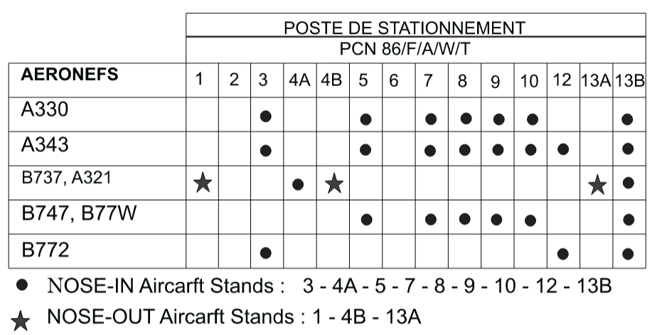

# Ground
!!! info Cotonou does not have a dedicated Ground frequency, as such all Ground responsibilities are assumed by Cotonou Tower (DBBB_TWR). Under no circumstances should a DBBB_GND position ever be opened without prior approval from staff.

## Parking Stand Restrictions

The following table details the Parking stand wingspan restrictions for the Cotonou Airport. 

!!! note Code F aircraft are not permitted to operate out of the Cotonou Airport. However, since VATSIM is VATSIM, code F aircraft can be accommodated with stands 7-10.  

## Pushback Procedures

### Directions
| Runway in use | Pushback clearance |
| :---------: | :---------: |
| 21 | Facing East |
| 03 | Facing West | 

!!! info "Pushback Phraseology"
    "(callsign), push and start approved, facing west, QNH (QNH)."

!!! info "Taxi Out Stands"
    Traffic parked on stands 1, 4B, 13A.

## Taxi Procedures

### Taxi Out
  * When Runway 24 is active, departing traffic shall be instructed to taxi to holding point A.
  * When Runway 06 is active, departing traffic shall be instructed to taxi to holding point B.
  * Traffic should advise whether Backtrack onto Runway 06 or 24 is required.
  * It can be assumed that all medium and heavy category aircraft require backtrack. 

### Taxi in
  * The Tower controller should give priority to arriving traffic taxiing to their stand before issuing pushback clearances to departing traffic. This is to prevent traffic from blocking holding points A and B.  
 
!!! info "Taxi Phraseology"
    "(callsign), taxi to holding point A Runway 24."

## Visual Flight Rules (VFR) Start-up and Taxi Procedures
On initial call with Tower, the VFR aircraft is expected to provide:

* Aircraft Registration, if the callsign used is not the aircraft registration
* Aircraft Type
* Persons on Board
* Fuel Endurance
* Intentions

Once this data has been received by the Tower controller, the controller shall then issue the QNH, Active runway, and if operating on a FPL, a squawk.

!!! info "VFR Phraseology"
    "TYOWU, thank you, start up approved, Runway 24 in use, QNH 1021, report ready for taxi."
    
