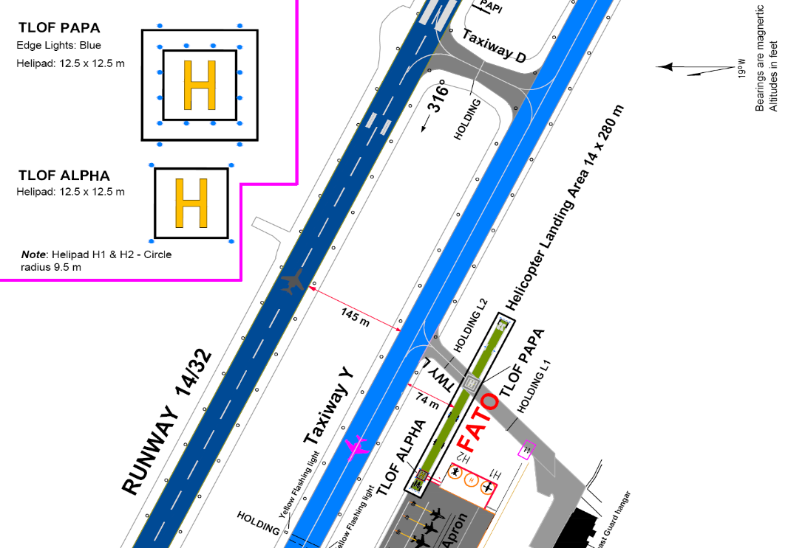
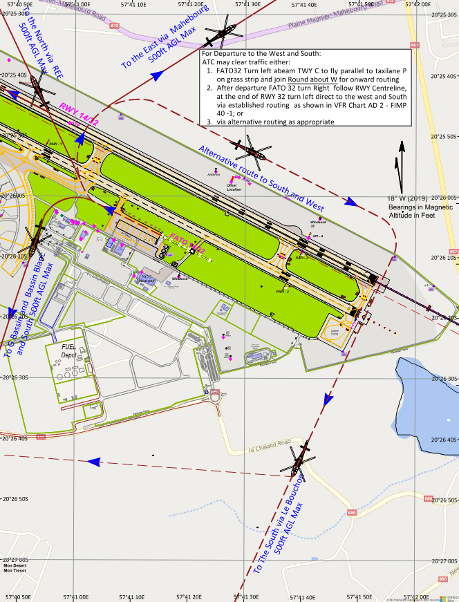
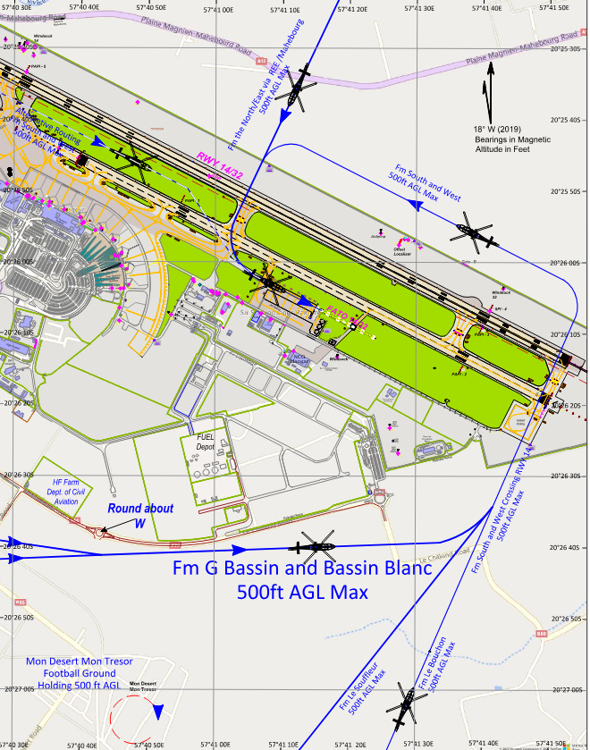
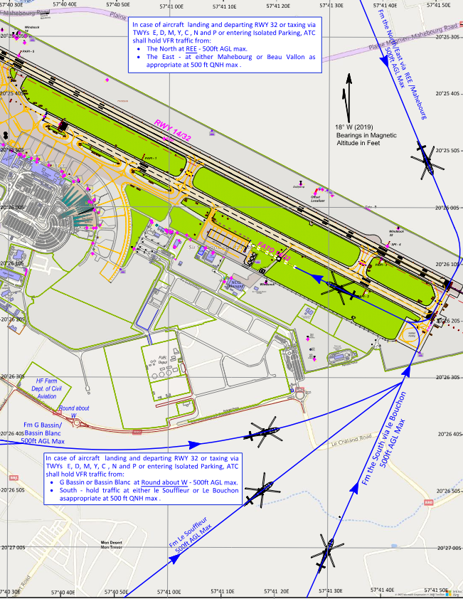

# Tower
The responsibility of Tower at Mauritius falls to the dedicated Tower ATS unit, "Mauritius Tower" (FIMP_TWR) on 119.100. TWR will be responsible for the movements on the runway, as well as the responsibility of ensuring safety amongst VFR aircraft operating in the circuit or within the Mauritius CTR from GND - 3500ft MSL.

!!! note
    Departure handoffs go to Mauritius Approach (FIMP_APP) on frequency 119.100

## Visual Flight Rules (VFR) Aircraft

### Fixed-Wing Aircraft

  * There are no published VFR departure or arrival routings in and out of the Mauritius CTR for fixed-wing aircraft. Traffic should instead be asked to report either leaving or entering the CTR.
  * Circuit altitude is 2000ft, with circuits away from the terminal building. Runway 14 (Left Hand), Runway 32 (Right Hand).
  * Controllers should avoid extending downwinds significantly to avoid terrain north-west of the field.
  * VFR traffic is not permitted if the cloud ceiling is below 1500ft or if the visibility is less than 5000m.

!!! info "Circuit Clearance"
    3BMRU, hold position, after departure Runway 14, left hand circuits, not above 2000, report left downwind Runway 14.

!!! info "Exit Clearance"
    3BMRU, hold position, after departure Runway 14, cleared to leave the control zone to the north/south, not above 2000ft report zone outbound"

### Helicopters

Helicopter operations form a big part of aircraft operations around the Mauritius Island. Contrary to Fixed-Wing aircraft, helicopters operating into and out of the Mauritius CTR must strictly adhere to standard operating procedures.

  * The Mauritius Sir Seewoosagur Ramgoolam International Airport has a dedicated helicopter landing area, referred to as the Final Approach and Take Off (FATO) area. 
  * The FATO area lies parallel to the main operating Runway 14/32 and is referred to as FATO 14/32 depending on the active runway.
  * Helicopter Traffic entering and exiting the Mauritius CTR must depart from the FATO and follow the published departure and arrival routings. 

!!! warning "Dependent operations with Runway 14/32"
    Simultaneous parallel fixed-wing aircraft operations on RWY 14/32 and helicopter operations on FATO 14/32 is not permitted. Helicopter traffic will be expected to hold over the published entry and exit Visual Reporting Points. (VRPs)    

 
 
 
 
 

 
## Wake Seperation

### Arrivals (nm)
| Lead  | J | H | M | L |
| :---------: | :---------: | :---------: | :---------: | :---------: | 
| J     | ||||
| H     | 6 | 4 | ||
| M     | 7 | 5 | 5 | |
| L     | 8 | 6 | 5 | 5 |

### Departures (mins)

| Lead  | J | H | M | L |
| :---------: | :---------: | :---------: | :---------: | :---------: | 
| J     | ||||
| H     | 2 | |||
| M     | 3 | 2 | ||
| L     | 3 | 2 | 2 | |

## Backtracking and Turning Pads

Traffic departing on Runway 14 may require a backtrack to make use of the full runway length. The airport has two turning pads at the threshold of Runway 14, 
  * Turning Pad No. 1 ("Starter Extension"), situated at the furthest end of the runway (TORA 3370m).
  * Turning Pad No. 2, situated at the threshold of Runway 14 (TORA 3040m)

The runway has a displaced threshold between Turning Pad No. 1 and Turning Pad No. 2. Departures from both turning pads are considered to be full-length departures. 

!!! info "Info"
    Turning Pad No. 2 is not approved for use with Code F aircraft. Larger Code E aircraft (such as the Boeing 777-300/777-300ER series) are also encouraged to make use of the Starter Extension.  

## Takeoff Phraseology

!!! info "Takeoff (Full Length)"
    3BMRU, Runway 14, wind 080 degrees at 9 knots, cleared for takeoff.

!!! info "Takeoff (Intersection)"
    3BMRU, Intersection A Runway 14, wind 080 degrees at 9 knots, cleared for takeoff.

## Missed Approach

All aircraft are to comply with standard missed approach. Once the aircraft has been observed climbing out again, you may hand off to Mauritius Approach for further.
