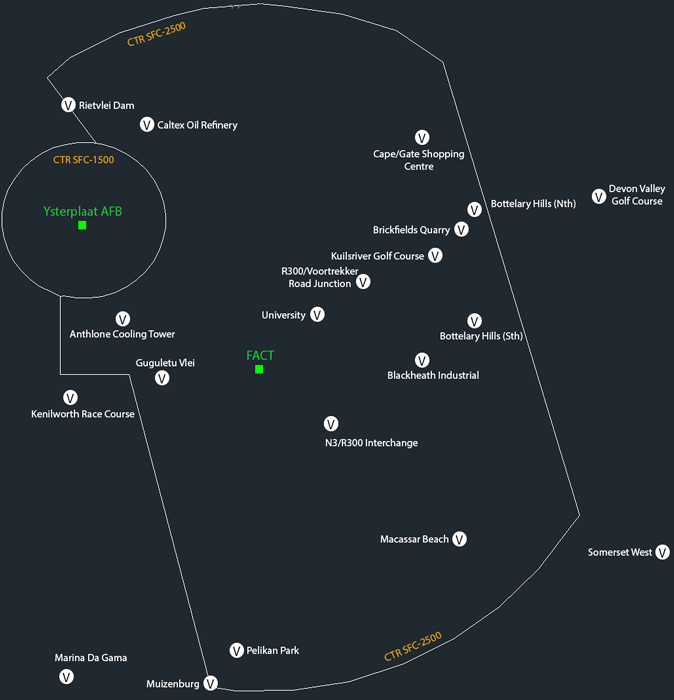
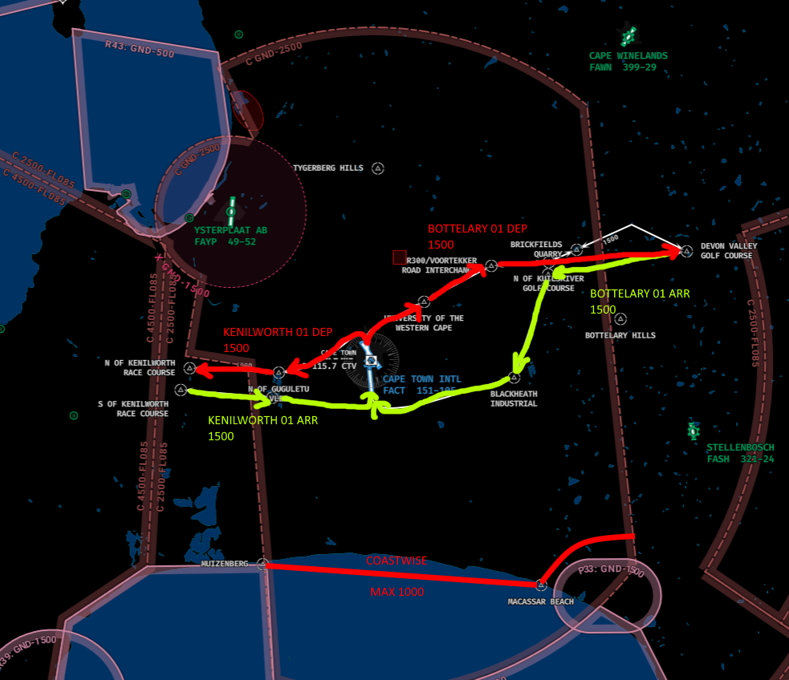
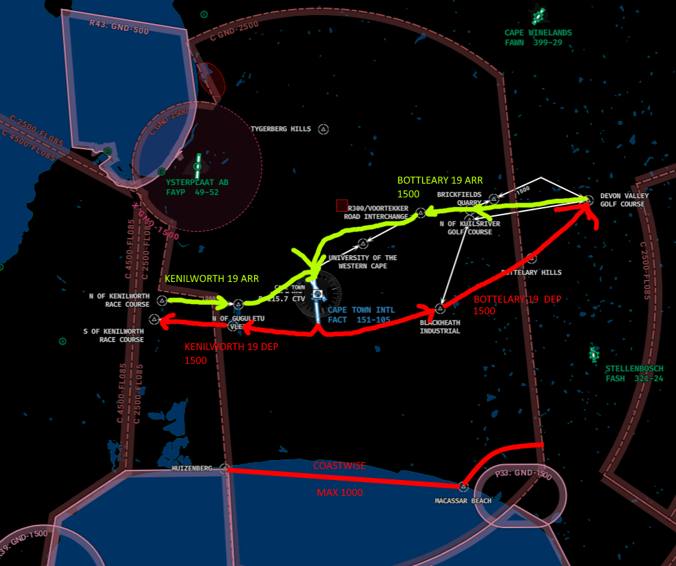

# Tower
The responsibility of Tower at Cape Town falls to the dedicated Tower ATS unit, "Cape Town Tower" (FACT_TWR) on 118.100. TWR will be responsible for the movements on the runway, as well as the responsibility of ensuring safety amongst VFR aircraft operating in the circuit or within the Cape Town CTR from GND - 2500ft MSL.

!!! note
    As the frequency for departure is already handed in the IFR clearance, handoffs to the next ATS unit (Cape Town Approach) is not required with departing aircraft.

## Visual Flight Rules (VFR) Aircraft

| Type | Circuit Altitude |
| :---------: | :---------: |
| Jet | 2000ft |
| Turbine / Piston | 1500ft |
| Helicopter | 1000ft |

* All circuits are conducted left hand normally, but may be conducted right hand at the discretion of the Tower controller..

!!! info "Circuit Clearance"
    ZSABC, hold position, after departure Runway 19, left hand circuits, not above 1500ft, report left downwind Runway 19.

!!! info "Circuit Clearance (Non STD)"
    ZSABC, hold position, after departure Runway 19, non standard right hand circuits, not above 1500ft, report non standard right downwind Runway 19.

### VRP Map

### VFR Runway 01 Departures / Arrivals

| Departure | Report Point |
| --------- | | --------- |
| Kenilworth 01 | North of Kenilworth Race Course |
| Bottlehary 01 | Abeam the Bottlehary Hills |

| Arrival | Report Point |
| --------- | | --------- |
| Kenilworth 01 | Left Downwind Runway 01 |
| Bottlehary 01 | Non Standard Right Downwind Runway 01 |

### VFR Runway 19 Departures / Arrivals

| Departure | Report Point |
| --------- | | --------- |
| Kenilworth 19 | South of Kenilworth Race Course |
| Bottlehary 19 | Abeam the Bottlehary Hills |

| Arrival | Report Point |
| --------- | | --------- |
| Kenilworth 01 | Non Standard Right Downwind Runway 01 |
| Bottlehary 01 | Left Downwind Runway 01 |

!!! info "Exit Clearance via STD VFR Departure Routing"
    ZSABC, hold position, after departure Runway 19, comply with the Bottlehary 19 departure, not above 1500ft, report abeam the Bottlehary Hills."

## Wake Seperation

### Arrivals (nm)
| Lead  | J | H | M | L |
| :---------: | :---------: | :---------: | :---------: | :---------: | 
| J     | ||||
| H     | 6 | 4 | ||
| M     | 7 | 5 | 5 | |
| L     | 8 | 6 | 5 | 5 |

### Departures (mins)

| Lead  | J | H | M | L |
| :---------: | :---------: | :---------: | :---------: | :---------: | 
| J     | ||||
| H     | 2 | |||
| M     | 3 | 2 | ||
| L     | 3 | 2 | 2 | |

## Takeoff Phraseology

!!! info "Takeoff (Full Length)"
    ZSABC, Runway 19 full length, wind 080 degrees at 9 knots, cleared for takeoff, bye bye.

!!! info "Takeoff (Intersection)"
    ZSABC, Runway 19 at E1, wind 080 degrees at 9 knots, cleared for takeoff, bye bye.