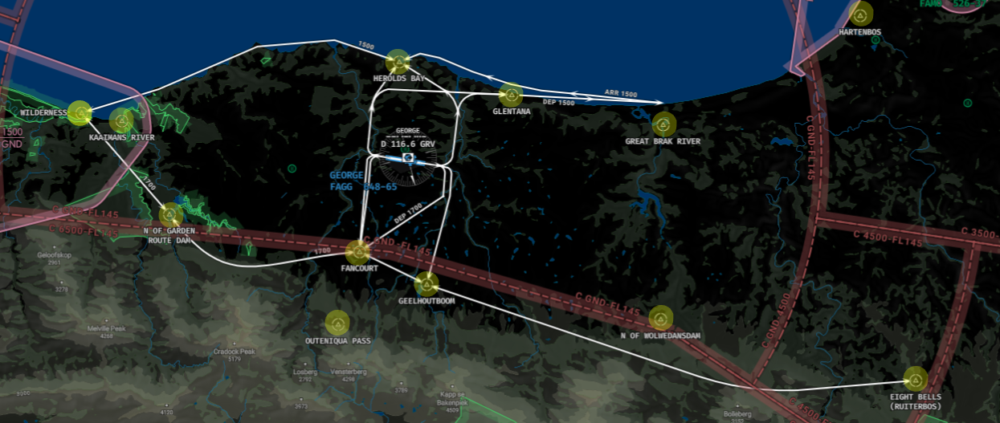
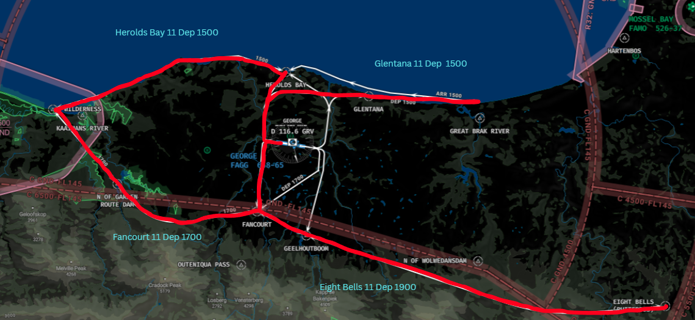

# Tower
The responsibility of Tower at George falls to the dedicated Tower ATS unit, "George Tower" (FAGG_TWR) on 118.900. TWR will be responsible for the movements on the runway, as well as the responsibility of ensuring safety amongst VFR aircraft operating in the circuit or within the George CTR from GND - 4500ft MSL.

!!! note
    As the frequency for departure is already handed in the IFR clearance, handoffs to the next ATS unit (George Approach) is not required with departing aircraft.

## Visual Flight Rules (VFR) Aircraft
  * Circuit altitude is 1500ft.
  * There is no set direction for circuits. The Tower controller may select either left hand or right hand circuits.

!!! info "Circuit Clearance"
    ZSABC, hold position, after departure Runway 11, left hand circuits, not above altitude 1500ft, report left downwind Runway 11.
    
!!! info "Circuit Clearance"
    ZSABC, hold position, after departure Runway 29, right hand circuits, not above altitude 1500ft, report right downwind Runway 29.

### VRP Map

### VFR Runway 11 Departures 

| Departure | Report Point | Altitude |
|--------|--------------|----------|
| Gletana 11 | Great Brak River | 1500 ft |
| Eight Bells 11 | Wolwedans Dam | 1900 ft |
| Herolds Bay 11 | Kaaimans River | 1500 ft |
| Fancourt 11 | Garden Route Dam | 1700 ft |

!!! info "Exit Clearance via STD VFR Routing"
    ZSABC, hold position, after departure Runway 11, comply with the Gletana 11 departure, not above altitude 1500ft, report overhead Great Brak River.
    
### VFR Runway 29 Departures 

| Departure | Report Point | Altitude |
|--------|--------------|----------|
| Gletana 29 | Great Brak River | 1500 ft |
| Eight Bells 29 | Wolwedans Dam | 1900 ft |
| Herolds Bay 29 | Kaaimans River | 1500 ft |
| Fancourt 29 | Garden Route Dam | 1700 ft |

!!! info "Exit Clearance via STD VFR Routing"
    ZSABC, hold position, after departure Runway 29, comply with the Gletana 29 departure, not above altitude 1500ft, report overhead Great Brak River.
    
### VFR Arrivals 

!!! Warning "VFR Arrivals"
    All VFR arrivals will be required to report over the relevant point. They will then require further instructions to enter the downwind.
    
| Arrival | Report Point | Altitude |
|--------|--------------|----------|
| Wilderness 11 / 29 | Herolds Bay | 1500 ft |
| Eight Bells 11 / 29 | Fancourt | 1500 ft |
| Herolds Bay 11 / 29 | Herolds Bay | 1500 ft |
| Fancourt 11 / 29 | Fancourt | 1700 ft |

!!! info "Entry Clearance"
    ZSABC, Cleared to enter the George CTR, standard (Arrival) routing, not above altitude XXXX ft, report overhead (Report Point). 

!!! info "Circuit Entry Clearance"
    ZSABC, Report XXXX downwind, runway XX
    
## Wake Seperation

### Arrivals (nm)
| Lead  | J | H | M | L |
| :---------: | :---------: | :---------: | :---------: | :---------: | 
| J     | ||||
| H     | 6 | 4 | ||
| M     | 7 | 5 | 5 | |
| L     | 8 | 6 | 5 | 5 |

### Departures (mins)

| Lead  | J | H | M | L |
| :---------: | :---------: | :---------: | :---------: | :---------: | 
| J     | ||||
| H     | 2 | |||
| M     | 3 | 2 | ||
| L     | 3 | 2 | 2 | |

## Takeoff Phraseology

!!! info "Takeoff (Full Length)"
    ZSABC, Runway 11 full length, wind 160 degrees at 4 knots, cleared for takeoff, bye bye.

!!! warning "Intersection Takeoffs"
    Intersection takeoffs are not available at FAGG.
