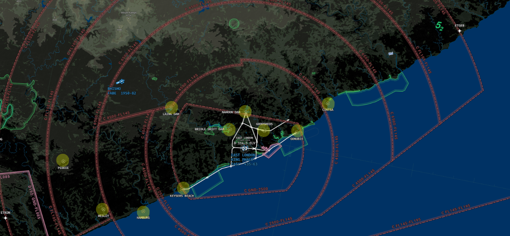
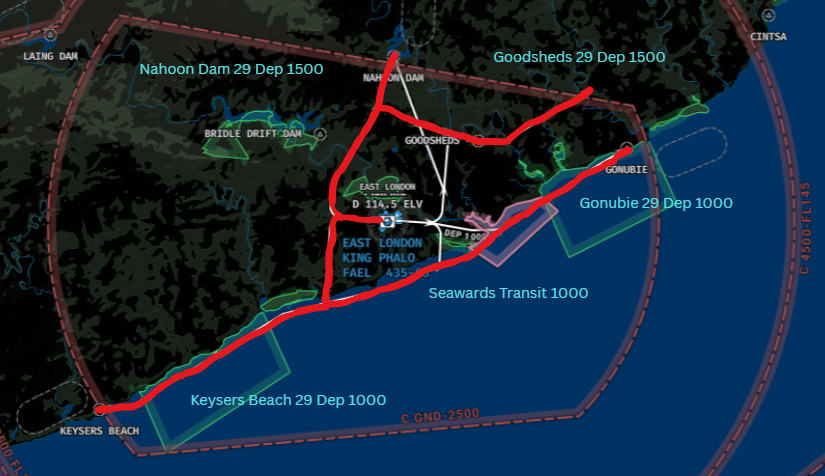

# Tower
The responsibility of Tower at King Phalo falls to the dedicated Tower ATS unit, "East London Tower" (FAEL_TWR) on 118.300. TWR will be responsible for the movements on the runway, as well as the responsibility of ensuring safety amongst VFR aircraft operating in the circuit or within the King Phalo CTR from GND - 2500ft MSL.

!!! note
    As the frequency for departure is already handed in the IFR clearance, handoffs to the next ATS unit (East London Approach) is not required with departing aircraft.

## Visual Flight Rules (VFR) Aircraft

| Type | Circuit Altitude |
| :---------: | :---------: |
| Jet | 2000ft |
| Turbine / Piston | 1400ft |

* All circuits are conducted left hand normally, but may be conducted right hand at the discretion of the Tower controller.

!!! info "Circuit Clearance"
    "ZSABC, hold position, after departure Runway 11, cleared left hand circuits, not above altitude 2000ft, report left downwind Runway 11."
    
!!! info "Circuit Clearance (Non STD)"
    "ZSABC, hold position, after departure Runway 11, non standard right hand circuits, not above 2000ft, report non standard right downwind Runway 19."

### VRP Map

### VFR Runway 11 Departures 

| Departure | Report Point | Altitude |
|--------|--------------|----------|
| Keysers Beach 11 | Keyser Beach | 1000 ft |
| Gonubie 11 | Gonubie | 1000 ft |
| Nahoon Dam 11 | Nahoon Dam | 1500 ft |
| Goodsheds 11 | Abeam Gonubie | 1500 ft |
| Seawards Transit | Keysers Beach / Gonubie | 1000 ft |

!!! info "Exit Clearance via STD VFR Routing"
    "ZSABC, hold position, after departure Runway 11, comply with the Keysers Beach 11 departure, not above altitude 1000ft, report overhead Keyser Beach."

!!! info "Sewards Transit"
    "ZSABC, cleared to transit the King Phalo CTR, remain seawards of the coastline, not above altitude 1000ft, report overhead Keysers Beach / Gonubie."
    
### VFR Runway 29 Departures 

| Departure | Report Point | Altitude |
|--------|--------------|----------|
| Keysers Beach 29 | Keyser Beach | 1000 ft |
| Gonubie 29 | Gonubie | 1000 ft |
| Nahoon Dam 29 | Nahoon Dam | 1500 ft |
| Goodsheds 29 | Abeam Gonubie | 1500 ft |
| Seawards Transit | Keysers Beach / Gonubie | 1000 ft |

!!! info "Exit Clearance via STD VFR Routing"
    "ZSABC, hold position, after departure Runway 29, comply with the Keysers Beach 29 departure, not above altitude 1000ft, report overhead Keyser Beach."

!!! info "Sewards Transit"
    "ZSABC, cleared to transit the King Phalo CTR, remain seawards of the coastline, not above altitude 1000ft, report overhead Keysers Beach / Gonubie."
    
### VFR Arrivals 

!!! Warning "VFR Arrivals"
    All VFR arrivals will be required to report over the relevant point. They will then require further instructions to enter the circuit.
    
| Arrival | Report Point | Altitude |
|--------|--------------|----------|
| Hamburg 11 / 29 | Keysers Beach | 1000 ft |
| Nahoon Dam 11 / 29 | Nahoon Dam | 1500 ft |
| Gonubie 11 / 29 | Gonubie | 1500 ft |
| Seawards Transit | Keysers Beach / Gonubie | 1000 ft |

!!! info "Entry Clearance"
    "ZSABC, Cleared to enter the King Phalo CTR, standard Hamburg XX routing, not above altitude 1000 ft, report overhead Keysers Beach."

!!! info "Sewards Transit"
    "ZSABC, cleared to transit the King Phalo CTR, remain seawards of the coastline, not above altitude 1000ft, report overhead Keysers Beach / Gonubie."

!!! info "Circuit Entry Clearance"
    "ZSABC, Report XXXX downwind, runway XX."
    
## Wake Seperation

### Arrivals (nm)
| Lead  | J | H | M | L |
| :---------: | :---------: | :---------: | :---------: | :---------: | 
| J     | ||||
| H     | 6 | 4 | ||
| M     | 7 | 5 | 5 | |
| L     | 8 | 6 | 5 | 5 |

### Departures (mins)

| Lead  | J | H | M | L |
| :---------: | :---------: | :---------: | :---------: | :---------: | 
| J     | ||||
| H     | 2 | |||
| M     | 3 | 2 | ||
| L     | 3 | 2 | 2 | |

## Takeoff Phraseology

!!! info "Takeoff (Full Length)"
    "ZSABC, Runway 11 full length, wind 160 degrees at 4 knots, cleared for takeoff, bye bye."

!!! info "Backtrack"
    "ZSABC, backtrack runway 24."
    
!!! warning "Intersection Takeoffs"
    Intersection takeoffs are not available at FAEL.

