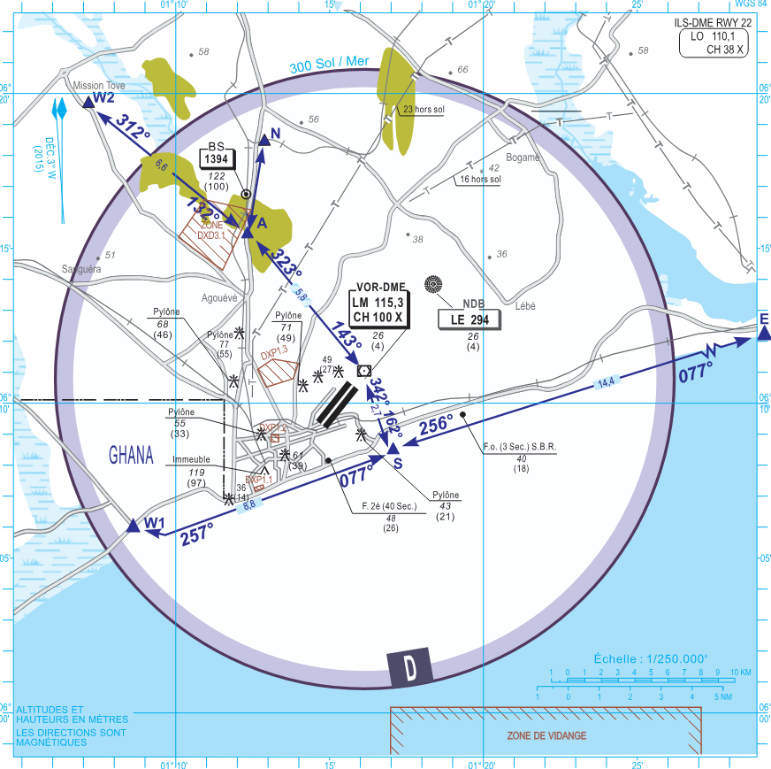

# Tower

The responsibility of Tower at Lomé falls to the dedicated Tower ATS unit, "Lomé Tower" (DXXX_TWR) on 121.700. TWR will be responsible for the movements on the runway, as well as the responsibility of ensuring safety amongst VFR aircraft operating in the circuit or within the Lomé CTR from GND - 1000ft MSL.

## Runway Selection
* Since Runway 22 is the only runway with a published precision approach procedure (ILS LOC), it is preferred for operations at the Lomé airport.
* Runway 04 should only be used if the usage of Runway 22 is with a significant tailwind component (more than 5kts).

## Runway Change Operations

  * Runway changes must be coordinate with existing TWR and APP controllers.
  * If possible, hold aircraft on stand before a runway change operation.
  * If an aircraft is already taxiing on Twy F, offer the pilot the option to use the existing active Rwy or to enter the runway for taxiway direction change.
  * If an aircraft as already passed an approach IAF fix, an APP or TWR controller should advise the pilot of the possibility of a runway change prior to the aircraft being on the final approach segment.

## Wake Separation

### Arrivals (nm)

| Lead  | J | H | M | L |
| :---------: | :---------: | :---------: | :---------: | :---------: | 
| J     | ||||
| H     | 6 | 4 | ||
| M     | 7 | 5 | 5 | |
| L     | 8 | 6 | 5 | 5 |

### Departures (mins)

| Lead  | J | H | M | L |
| :---------: | :---------: | :---------: | :---------: | :---------: | 
| J     | ||||
| H     | 2 | |||
| M     | 3 | 2 | ||
| L     | 3 | 2 | 2 | |

!!! note   
    Aircraft which are not affected by wake turbulence, and are operating on a different SID to the leading aircraft in front may be released as soon as the first aircraft is airborne.

## Takeoff Phraseology

!!! info "Takeoff (Full Length)"
    5VOWU, Runway 22 full length, wind 220 degrees at 9 knots, cleared for takeoff.

!!! info "Takeoff (Intersection)"
    5VOWU, Runway 04 at Intersection M, wind 020 degrees at 9 knots, cleared for takeoff.

!!! note
    Tower controllers may give the hand off instruction to Cotonou Approach with the take off clearance.

## Visual Flight Rules (VFR) Aircraft

| Rwy | Turn  | Altitude | Remarks |
| :---------: | :---------: | :---------: | :---------: |
| 22 | Right  | Up to 1000 AGL | - |
| 04 | Left | Up to 1000 AGL | - |

  * Circuit altitude is 1000ft, with circuits conducted away from the terminal. Runway 04 (Left Hand), Runway 22 (Right Hand).
  * Controllers should avoid extending downwinds significantly to keep VFR traffic close to the airfield.   
  * The Lomé CTR has standard VFR departure and arrival routings, with designated reporting points. 

### Reporting Points (VRPs)

| VRP | Geographical Feature |
| :---------: | :---------: | 
| W1 | Aflao/Accra/Ho Intersection (Ghana) |  
| A | Togblekope Parking Lot |  
| N | Pont d'Adetikope |  
| W2 | Mission-Tove |  
| S | Port of Lomé |  
| E | Kpeme Wharf | 

### Standard VFR Departures

  * CTR outbound traffic are to follow the standard routings towards a visual reporting point.
  * Once reporting overhead the VRP, the traffic may be handed off to the advisory frequency.  

| Direction of Entry | Routing |
| :---------: | :---------: | 
| North and North East | Proceed to point A, then exit via point N |  
| North West | Proceed to point A, then exit via point W2 |  
| West | Follow the coast from point S and exit via point W1 |  
| East and South East | Follow the coast from point S and exit via point E |  

### Standard VFR Arrivals

| Direction of Exit | Routing |
| :---------: | :---------: | 
| North and North East | Enter via point N and report overhead point A |  
| North West | Enter via point W2 and report overhead point A  |  
| West | Enter over point W1, Follow the coast and report overhead point S |  
| East and South East | Enter via point E, Follow the coast and report overhead point S |  

!!! note 
    Pilots are expected to be familiar with the standard arrival and departure routings. To simplify the entry and exit clearances, pilots should only be instructed to report overhead the applicable VRPs. 

### Map of Visual Reporting points

### Phraseology
!!! info "Circuit Clearance"
    "5VOWU, hold position, after departure Runway 22, right hand circuits, not above 1000ft, report left downwind Runway 22."

!!! info "Exit Clearance"
    5VOWU, hold position, after departure Runway 04, cleared to leave the control zone via point E, not above 1000ft, report overhead point E."

!!! info "Entry Clearance"
    5VOWU, cleared to enter the control zone via point W2, not above 1000ft, report overhead point A. 
