# Getting Started 

We have created a helpful user guide below in order to streamline our contributor onboarding process.

Please follow each step carefully to ensure your first Pull Request is succesful.

## What is a Ground Layout
A ground layout refers to a **ground radar layout** used for airports with ground radar installed for the purpose of visualising aircraft positions. VATSSA models our ground layouts to reflect real-life radar screens across the entirety of the VATSIM Sub-Saharan Africa Division. 

## Our Ground Layouts
Ground Layouts across VATSSA are made using the GroundRadar and TopSky plugins for EuroScope. The best way to learn it is by using examples provided on the Aerodrome Formats page for both TopSky and Euroscope found [here](https://eaip2.vatssa.com/Contributing/Sector%20Files/Aerodrome%20Formats/Overview/).

In addition you can view the [TopSky Documentation](https://forum.vatsim-scandinavia.org/d/258-topsky-plugin-26-beta-2) and [GroundRadar Documentation](https://forum.vatsim-scandinavia.org/d/256-ground-radar-plugin-16-beta-5) at their respective links. To access these, you will need to create a VATSCA forums account (you can do this by linking your VATSIM account) and download the plugins, in which a `Documentation` folder exists in the zipped archive which has all relevant documentation.

## Github Setup

- Our Sector Files are divided across 26 sectors, which cover all the airports in VATSSA airspace.

- The links to the repository of each Sector File can be found in the Overview repository [here](https://github.com/VATSIM-SSA/sectorfile-overview)

- It is a good idea to have a look through the different folders and familiarize yourself with the layout of each Sector File, primarily looking at the `Plugins/TopSky` and `Plugins/GroundRadar` folders.

- Create an issue first by going to the Issues tab and create a new issue regarding the specific ground layout if it dosen't exist already.

- Now we are going to "fork" the Sector File. Forking allows us to edit our own copy of the Sector File without changing anything on the main Sector File.

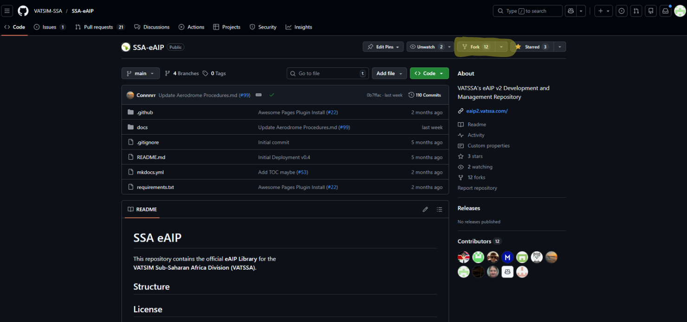

- Now that you have created your own repository, we can start to make edits.

- Head back to the Github home page, and you should see your fork of the eAIP. We call this a "repository."


- Now we can head over to our repository and start making changes.

- On the repository, click the green Code button and copy the HTTPS link

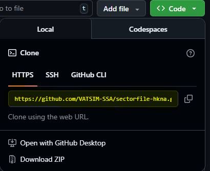

- Clone the repository into an appropriate directory by running `git clone {your URL} {destination}`. For purposes of ease of testing I recommend the sectorfile should be in a nested directory ie `FASA/FASA`

## Sectorfile Setup
- Like regular controlling, we will need a valid profile associated with the sectorfiles in order for us to test any ground layouts.
- Download the latest sectorfile
- Copy all the files except the folder with the name of the sectorfile to the outer directory.
- Your folder structure should now look like this with the Github repository clone inside, the "FASA" folder here:
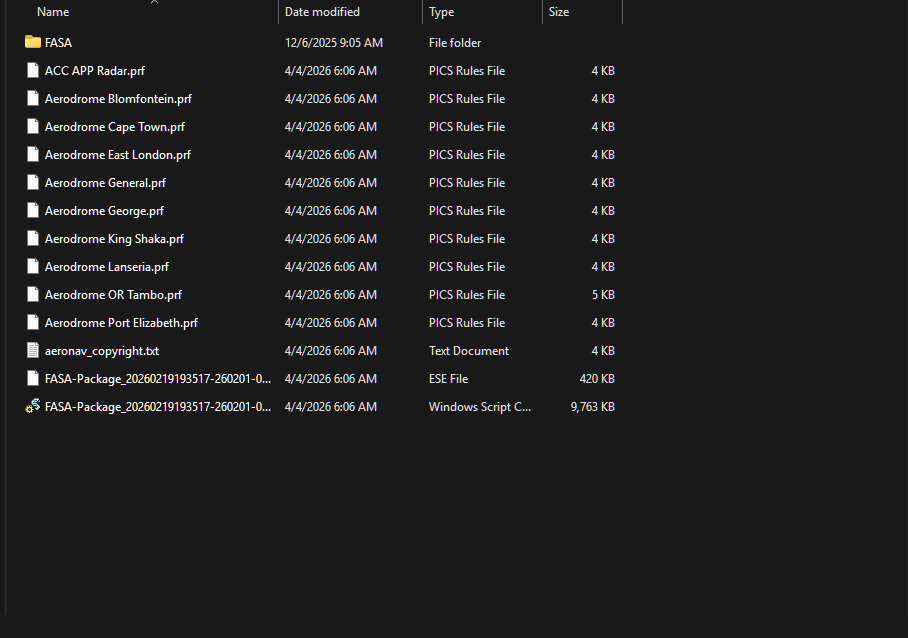


## QGIS Setup
- Download QGIS from [here](https://qgis.org)

- Get the [Aerodrome utilities](https://plugins.qgis.org/plugins/widen-line-qgis-plugin/) and [QuickOSM](https://plugins.qgis.org/plugins/QuickOSM/) via the link or via the plugin manager at `Plugins > Manage and Install Plugins > Not Installed` and searching for `Aerodrome Utilities` and `QuickOSM`

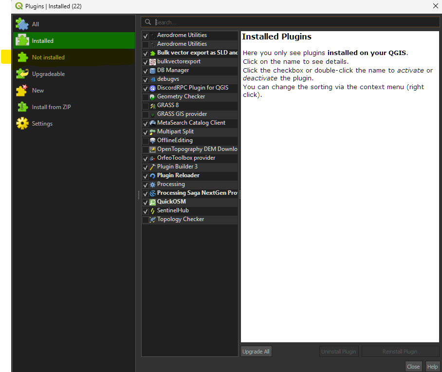

- [AerodromeUtilities](https://github.com/BrakingChanges/widen-line-qgis-plugin/) is the main plugin that will be used to manipulate and export aerodrome data to TopSky and EuroScope so that we can compile a ground layout in EuroScope.

- [QuickOSM](https://github.com/QuickOSM/QuickOSM) is a plugin that helps to simplify queries for OpenStreetMap data on the backend and get data faster.


## QGIS Initial Setup
- In the browser, drag in the OpenStreetMaps background layer via `XYZ Tiles > OpenStreetMaps`.

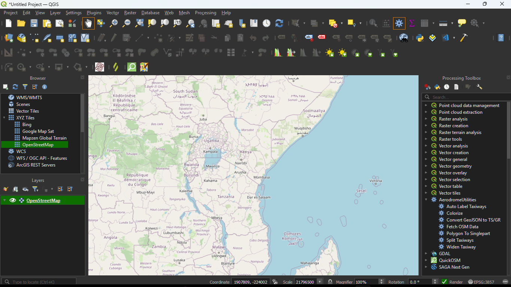

- Before creating the layouts I would recommend you create a folder where we will store all the saved files for our aerodrome.

## Importing Airport Data
- OpenStreetMap will be our primary source of airport data, together with satellite scenery further on.

- This process uses OpenStreetMap together with the aforementioned QuickOSM plugin to get airport data bundled together by OSM contributors into our workspace so that we can manipulate this data and get what we need for GroundRadar and TopSky.

- Change the CRS to `ESPG:4326` by clicking the projection symbol (globe and plane) on the bottom right.

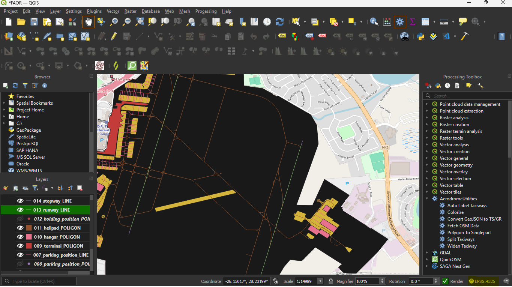

- This will open up a panel where you can apply `ESPG:4326`. **Without this, you will get weird timeout errors**.

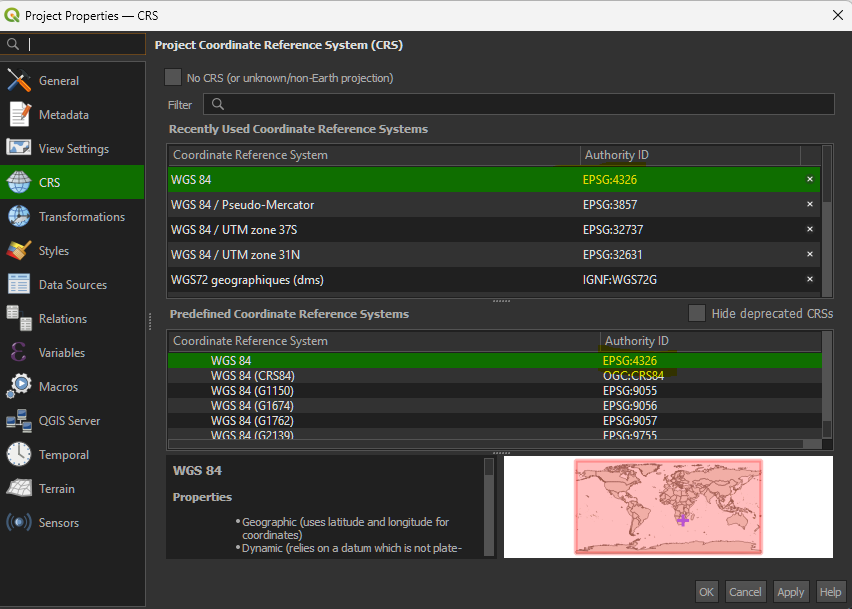

- To import airport data bring up the processing toolbox by clicking on the gear icon on the top toolbar or by pressing `Alt+T`. 
  
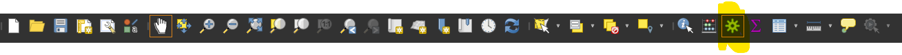

- Scroll to Aerodrome Utilities and select `Fetch OSM Data`.

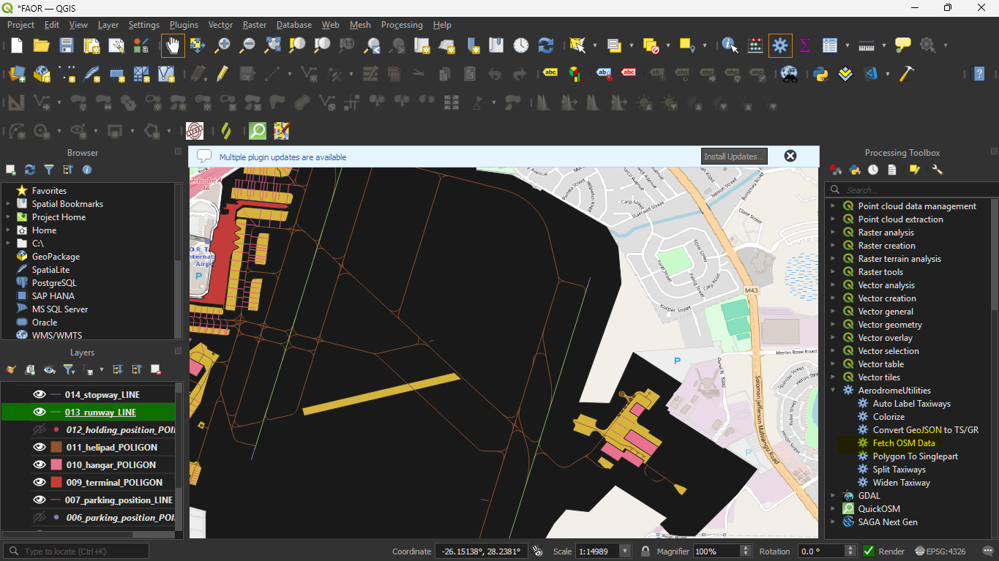

- Double click to open; a prompt will show up, this is what we call an algorithm.

- A few parameters are to be entered, mainly:

- ICAO code: The **ICAO** of the airport to fetch

- Automatically widen taxiways: Leave **unchecked** unless all the taxiways in your specified aerodrome are of a fixed taxiway width
- Automatically dissolved widened taxiways: Leave as-is.

- Keep Original Line as Centerline: Leave as-is.


- Color Profile (optional) - These are not necessary however are useful for accelerating airport development. A color scheme for FASA has been uploaded [here](colors-FASA.json). More color profiles can be uploaded later on. You can add that file.

- Split Taxiways Output Directory: Leave as-is.
- Output Directory: set the output directory to the folder you created for that specific airport.

- Clicking run will execute the algorithm and will start the automatic data fetch to get all the airport data for OpenStreetMap.

**NOTE: OSM servers are in high demand so you may be timed out from time-to-time, to fix this, click on the QuickOSM icon (looks like a search icon on the toolbar) and go to `Parameters` and change the Overpass API URL to change the server.**

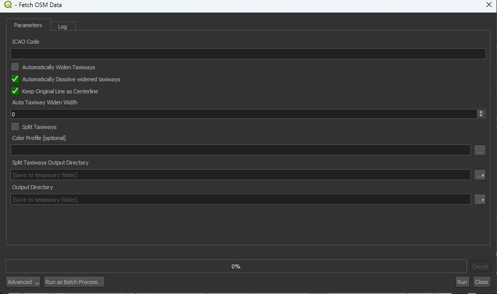
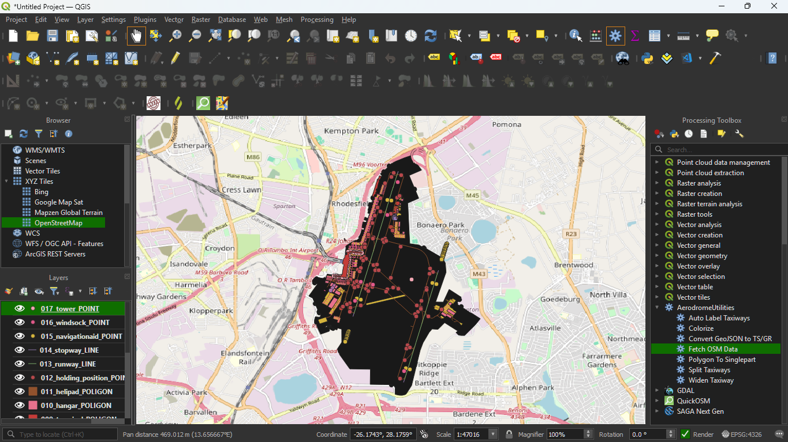

## Filtering Layers
- You can identify the layers toolbar on the bottom-left side of the screen.

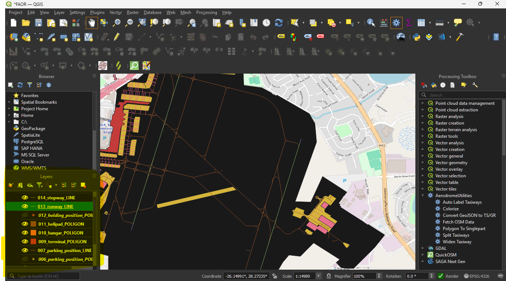

- To delete layers: you can either `Right-click > Remove Layer` or by clicking the remove layer icon in the layers toolbar.

- Depending on the number of layers, available each layer will be prefixed with a different number.

- However, the suffix after the number will always be the same.

- You can also use shift to select multiple layers.


- Delete the following layers, if they are present:
- `XXX_tower_POINT`
- `XXX_windsock_POINT`
- `XXX_navigationaid_POINT`
- `XXX_gate_POINT`
- `XXX_taxiway_POINT`
- `XXX_apron_POINT`
- `XXX_aeroway_aerodrome_points`

- To hide a layer, click the eye icon next to the layer:


- Hide the following layers, if they are present:
- `XXX_holding_position_POINT` (maybe helpful later when adding stop bars)
- `XXX_parking_position_POINT` (maybe useful for stands)

## Widening Taxiways and Runways

- When data is imported using OpenStreetMap, the runways and taxiways are often depicted by their centerlines.

- However, we need to the full taxiway and runway polygon.

- The first thing we need to do here, is to add a satellite map layer, either Bing or Google Maps.

- Scroll in the browser, right above the layers panel till you see XYZ Tiles

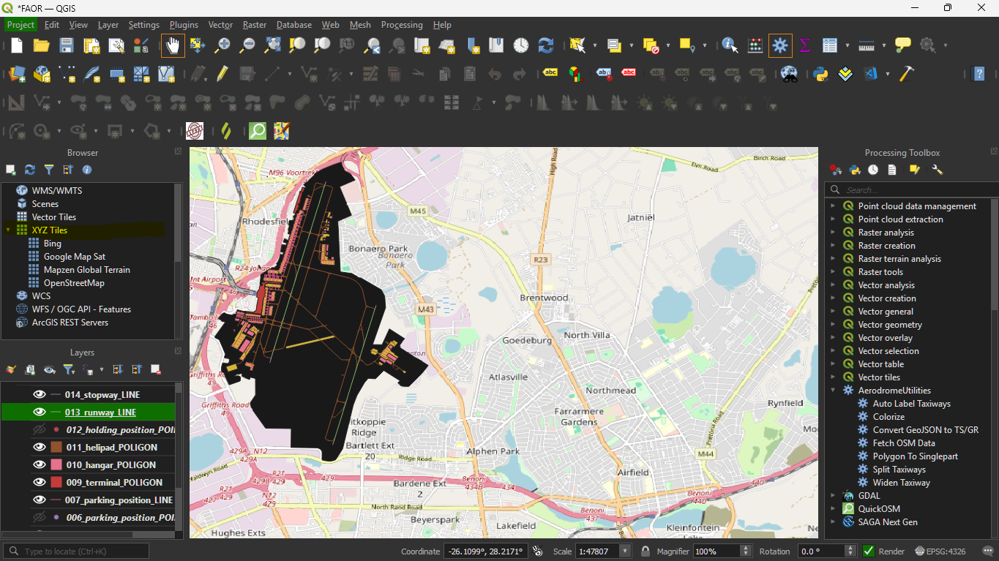

- Create a new connection by `Right-click > New Connection` which we will show a prompt to add a new connection source for XYZ Tiles

- XYZ Tiles are essentially what will be used to render the satellite map at different zoom levels, providing the greatest level of accuracy.

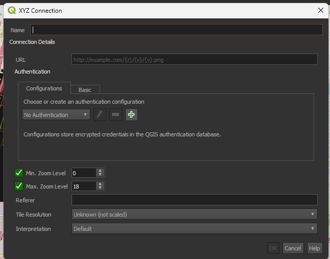

- Name the connection any suitable name

- Change the URL to
  * Google: https://www.google.cn/maps/vt?lyrs=s@189&gl=cn&x={x}&y={y}&z={z}
  * Bing: http://ecn.t3.tiles.virtualearth.net/tiles/a{q}.jpeg?g=1

- No other settings need to be changed.

- Click Ok to establish the new XYZ connection.

- Drag an satellite XYZ layer ie Google Maps down, above the OpenStreetMap layer.

- The canvas will change to a satellite map.

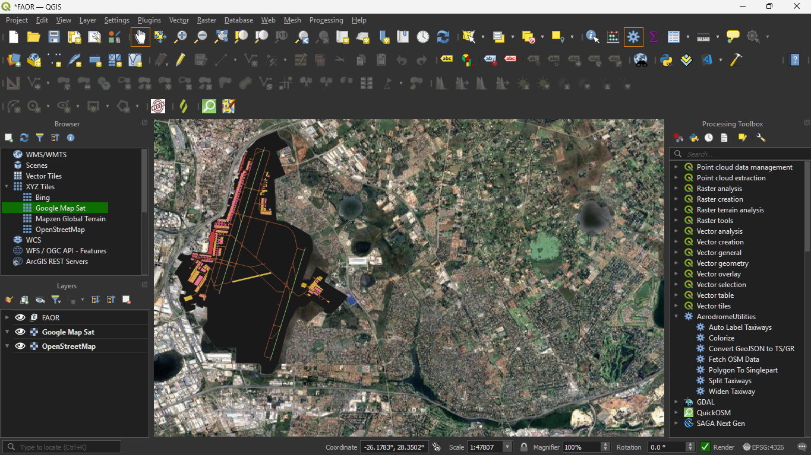

## Splitting Runway Layers

- In OpenStreetMaps, all runways are grouped under one layer.

- In order to convert the runwaay lines to polygon, each runway needs its own line layer, for us to control the widths of each runway individually.

- First select the runway, layer then `Right Click > Open Attribute Table` or press `F6`

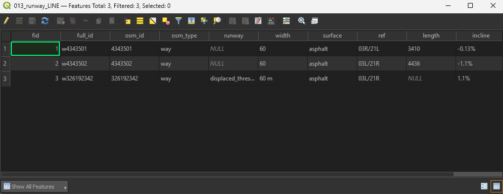

- The attribute table details all the parts, also called features used to make this layer.

- This also includes OSM attributes which help majorly.

- Note that when you click the row number of any specific part that part will be highlited on the map while getting an indication of the number of selected features.

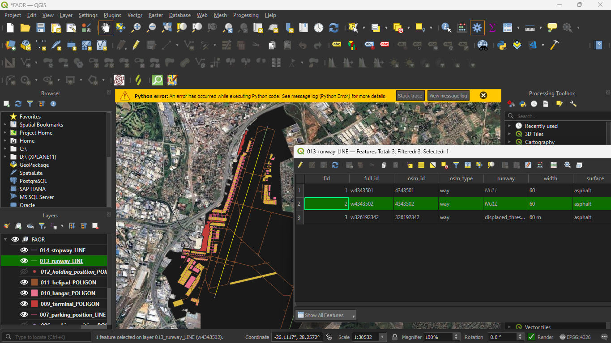

- To split the runway select all applicable faeatures, including displaced thresholds. To identify which displaced threshold belongs to which runway, use the AIP or select the displaced threshold and see which runway it lines up with

- Use `Ctrl` to select multiple features

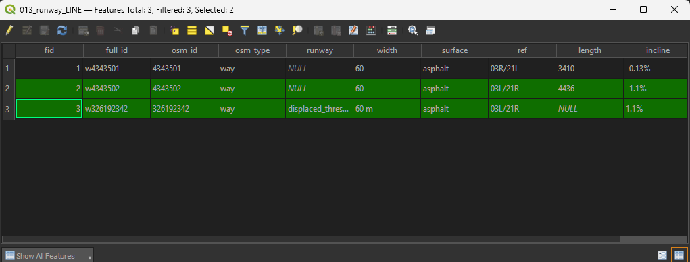

- To copy the selected features to the clipboard, use `Ctrl+C` or use the copy to clipboard icon 

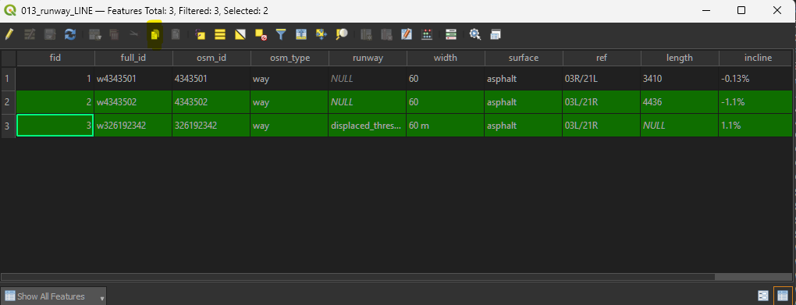

- To get the individual runway we are looking for, go to `Edit > Paste Features as > New Vector Layer`

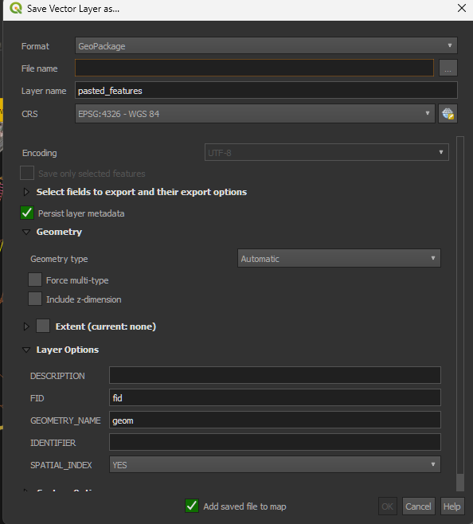

- In this dialog set the following:
- File name: Click the three dots to the right and navigate to the folder you set for the airport, name the file a suitable name (the name of the runway), instead of using a slash you can use an underscore for file names such as `RW 03L_21R` instead of `RW 03L/21R`
- Layer name: Name it the Runway, ie RW03L/21R
- Click OK to add it to the map.
- You can rename the layer name by `Right Click > Rename Layer` or by pressing `F2` as needed

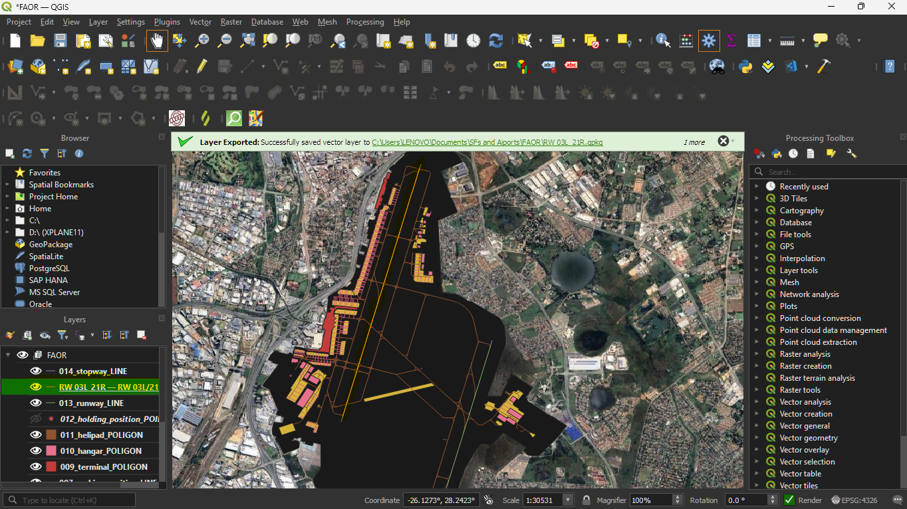

- Similarly the stopways can be split in the same manner to get seperate stopway layers for each runway.  

## Splitting Taxiways
- Before converting the taxiways, you may find it helpful to split the taxiway layer into each invidual taxiway reference ie `A`, `J`, `K` and so on.

- In the Processing Toolbox, under `Aerodrome Utilities`, locate the `Split Taxiways` algorithm.

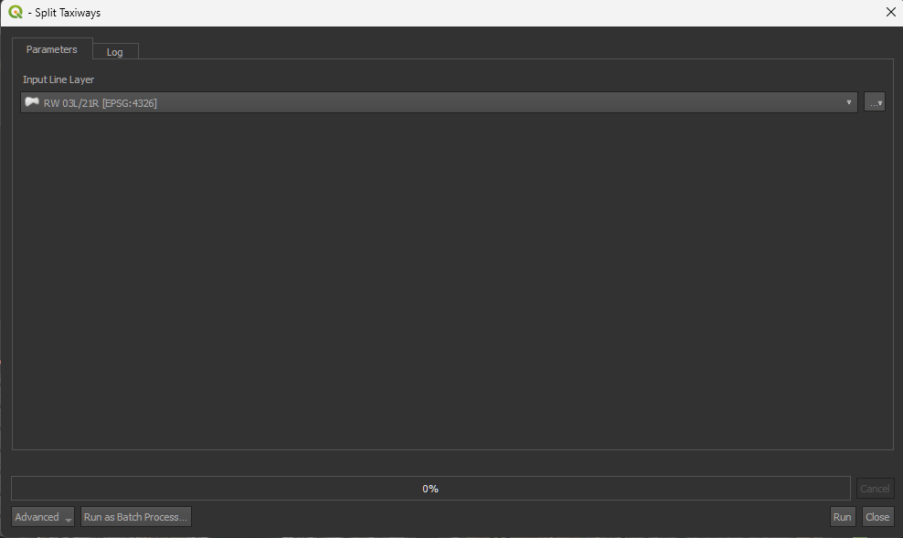

- Select the input layer, which should be your `_taxiway_centerline_LINE` layer.

- This will result in each taxiway getting its own layer, plus a  `TAXIWAY_NULL` layer to identify the taxiways that do not have a layer.

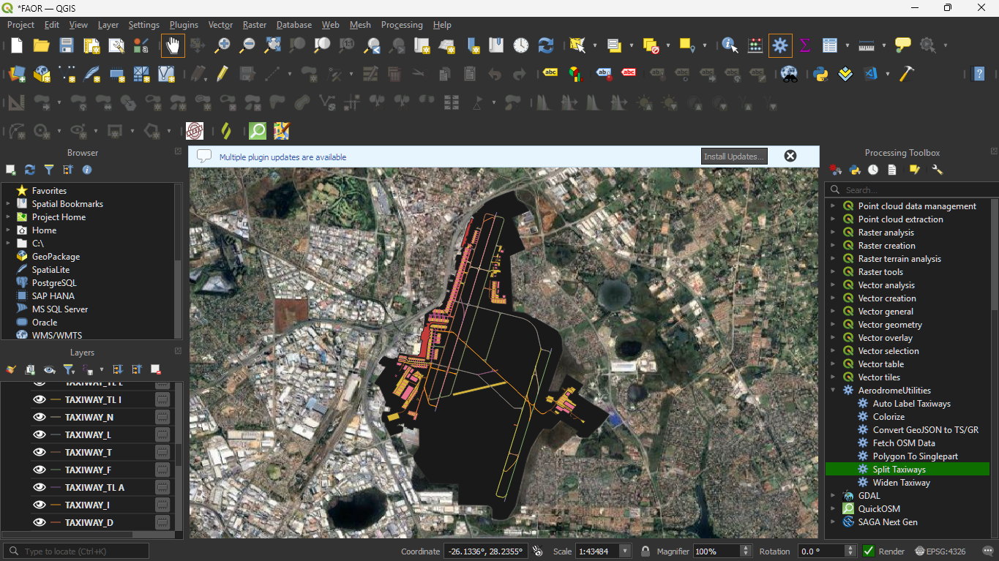
  
### A quick note on saving layers

- You will note that the right hand side of each layer has a memory chip icon.

- This indicates that this layer is a memory layer, temporary and the data will only exist while QGIS is open.

- If you close QGIS, you will lose all information about that layer.

- To save that layer, click on the memory chip will open a dialog similar to the paste as vector layer dialog


- To make the layers easier to manage, you can select all the newly created taxiway layers and group them.

- You can also delete any taxiway layers that are not in use, for example if all other taxiways have the same width except one taxiway, then only that taxiway is seperately needed.


## Runway/Taxiway Conversion

- The runways and stopways if existing, need to be converted into polygons so that they can be exported and rendered in EuroScope

- In the Processing Toolbox, under `Aerodrome Utilities`, double click the `Widen Taxiway` algorithm to open it.

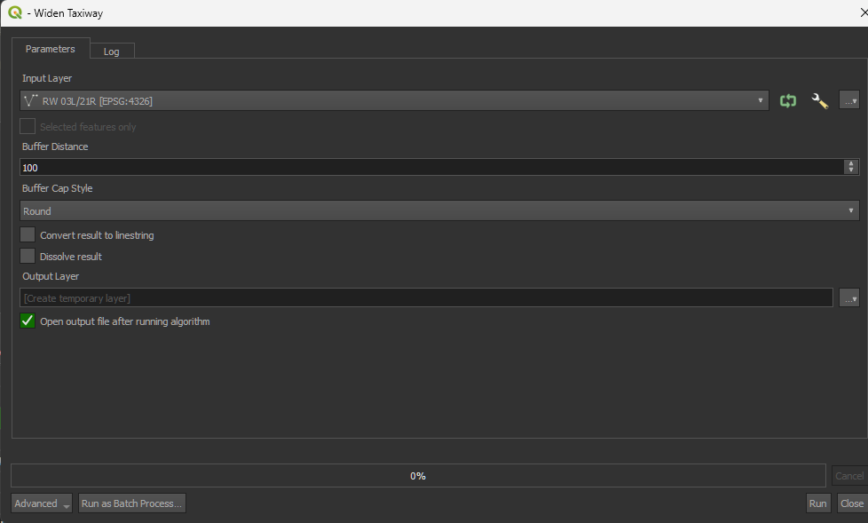

- Set the input layer to the runway which you are going to "widen" (so that it becomes a rectangle)

- Set the buffer distance to width of the runway as published in the eAIP.

- Change the buffer cap style to square as we want the runway edges to be rectangular, not rounded.

- Tick the checkbox to dissolve the result.

- For the output layer, parameter, click the 3 dots and choose save to GeoPackage then save it to a relevant location as discussed earlier.

- In the save prompt it will ask you the output layer name, name this whatever you want.

- Repeat the same process for stopways (if applicable)

- You can also use this process to convert taxiways.

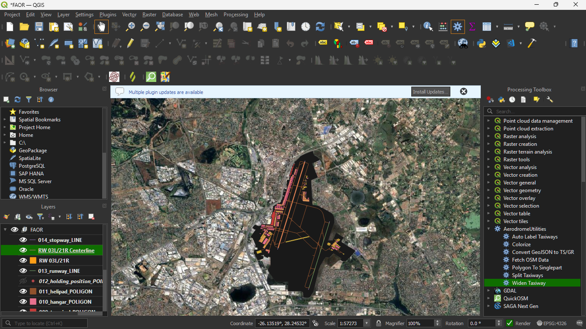

## Fine Tuning Runways and Taxiways

- In order to make the runways and taxiways look as realistic as possible we can adjust the layer order to get better accuracy.

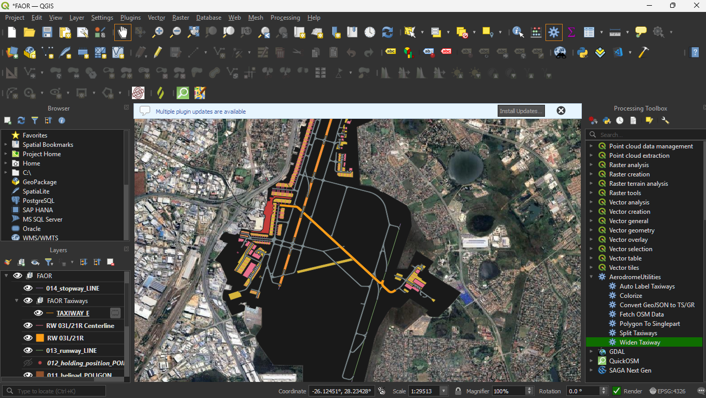

- In this case we move the runway layer above all other taxiways, by dragging the layer upwards.

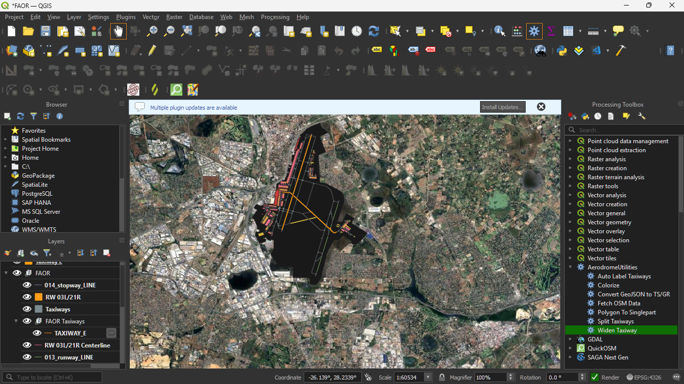

In this case, you can still notice that taxiway E does not make a perfect intersection with the runway.

To fix this we can edit the taxiway E layer so that it intercepts perfectly with 03L/21R.

To make it easier to edit, change the opacity of the Taxiway E layer by selecting the layer then presing `F7`. This will open the layer styling panel to the right, just above the processing toolbox.


Scroll down(if neccessary) until you see the opacity slider.

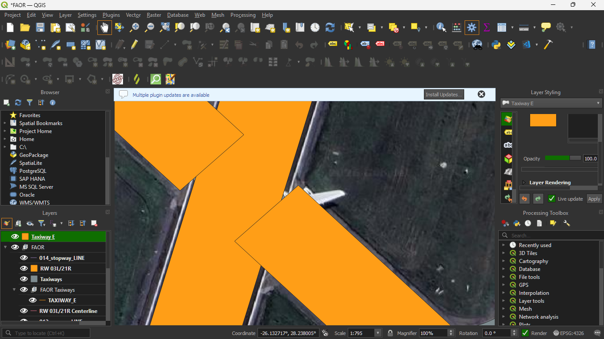

I would recommend reducing it to 50% or less so that you can see the underlying layers and it is easier to align the layers.


Next, we need to set the snapping options in this project, allowing us to snap the layers together without causing other errors later in the process.

Naviagate to the topbar, then select `Project > Snapping Options`

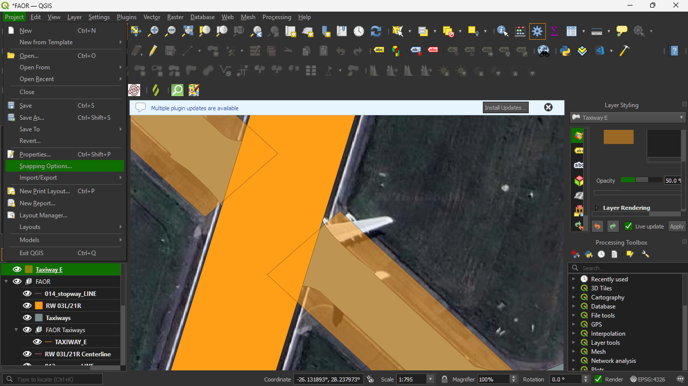

That will open a dialog like this:

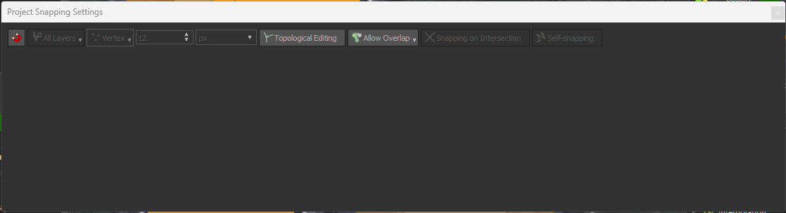

Click the magnet icon to enable snapping:

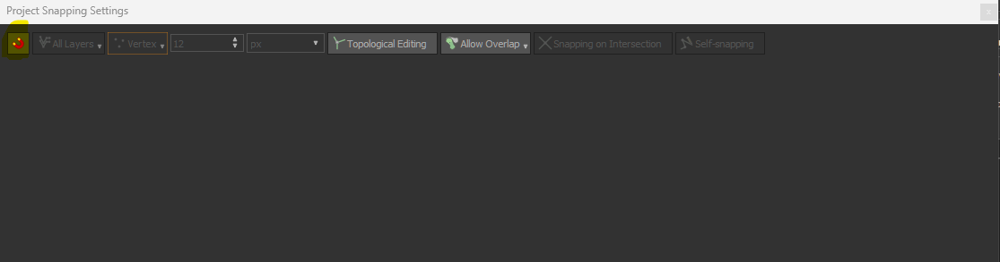

This will reveal the other settings related to snapping, primarily what we care about is the snapping mode:

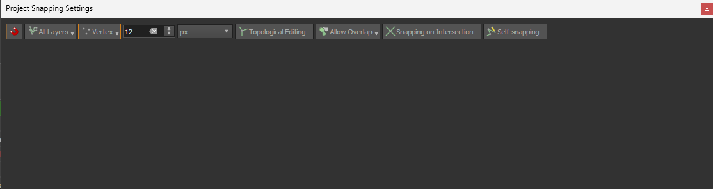

Which can be of:
- Vertex
- Segment
- Area
- Centroid
- Middle of Segment
- Line endpoints

!!! info
  99% of the time, you will only need vertex and segment, for our purposes, to be selected.

Ensure that vertex and segment are both selected, they should be underlined.

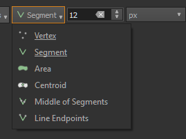

Note that as in, the image. The top selection may be only be one of the selected options, but you can also double-check by clicking the drop-down.

Briefly noting: The number 12 stands for the snapping radius, this may be helpful if you want to adjust the snapping behaviour of the snapping feature.

Allow Overlap dropdown - this decides whether snapping behaviour will allow overlap of different layers

Topological editing - a feature in QGIS that allows editing of objects with topographical information, while keeping them topographically correct (not needed here)

Snapping on intersection - As the name implies, this specifically enables snapping to intersections of different layers 

!!! info
  Self snapping - Allows features to snap to themselves, this may be useful if you are working with any taxiway that loops back on itself or when working with turning pads.

I would highly recommend only using the snapping feature when it is required, because most scenarios do not require accurate snapping.

Now let's edit taxiway E for this example.

With taxiway E selected, enter edit mode by clicking on the pencil icon on the to 2nd toolbar from the top.

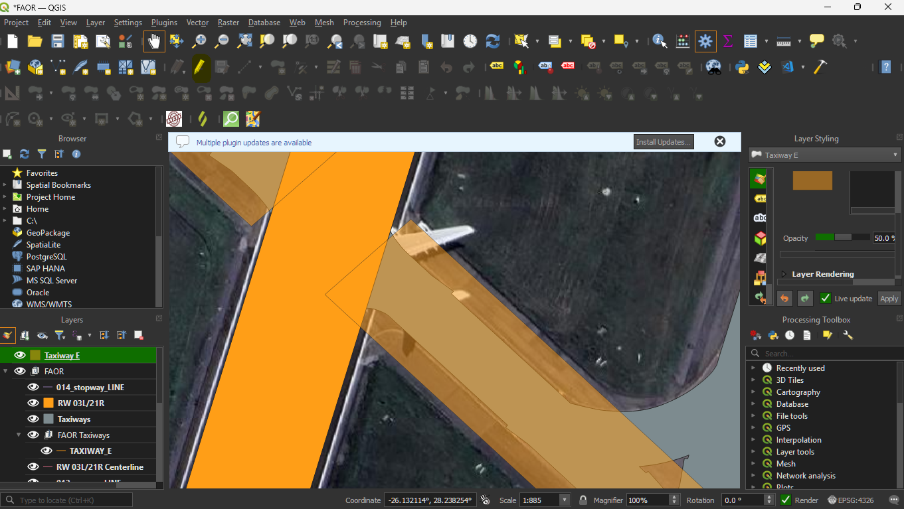

You will notice, when hovering over the layer it highlights all vertices and segments of that layer

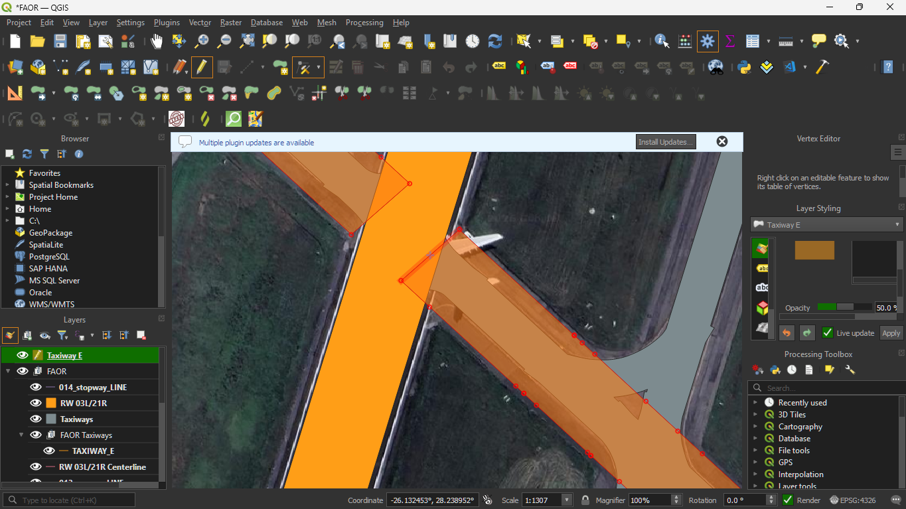

Now we can select and move the first 4 vertices and move them so that the snap to the layers like this:

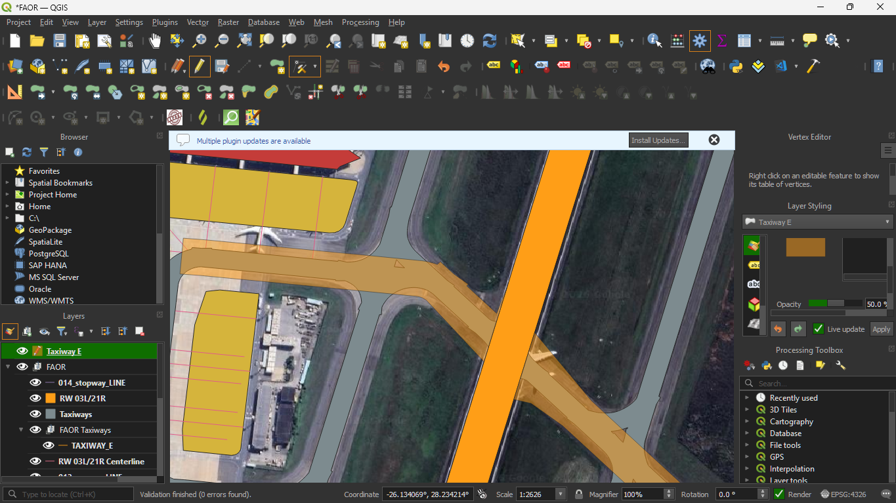

As you can see it is very intuitive to click and move around the vertices, and that the reduced opacity also allows us to see the satellite scenery layer, which will be helpful in the process of adding runway stripes later. The edits can be continued in a similar fashion.

Sometimes you may notice that there are not enough vertices to model the taxiway accurately. To solve this you can click the midpoint of any line segment (where there is +) to create a new vertex and drag them to the corresponding location.

Clicking on the (+) icon:
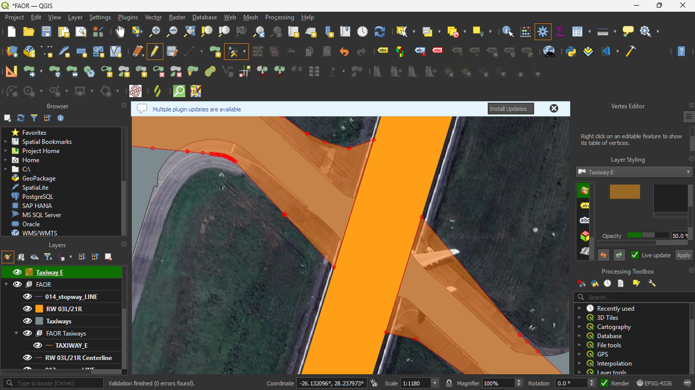

New Vertex created:
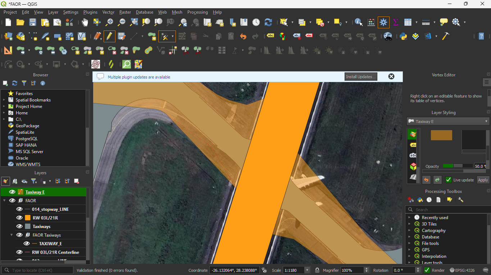

Dragging the vertex to the proper location:
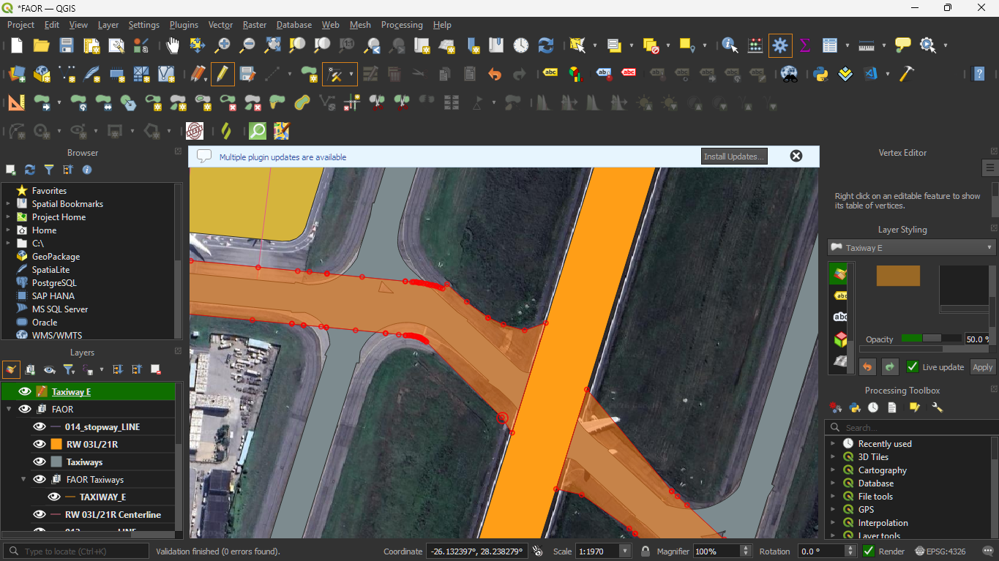

On the other hand, if a vertex needs to be deleted, click the vertex:


And the press the `Delete` key to delete the vertex:
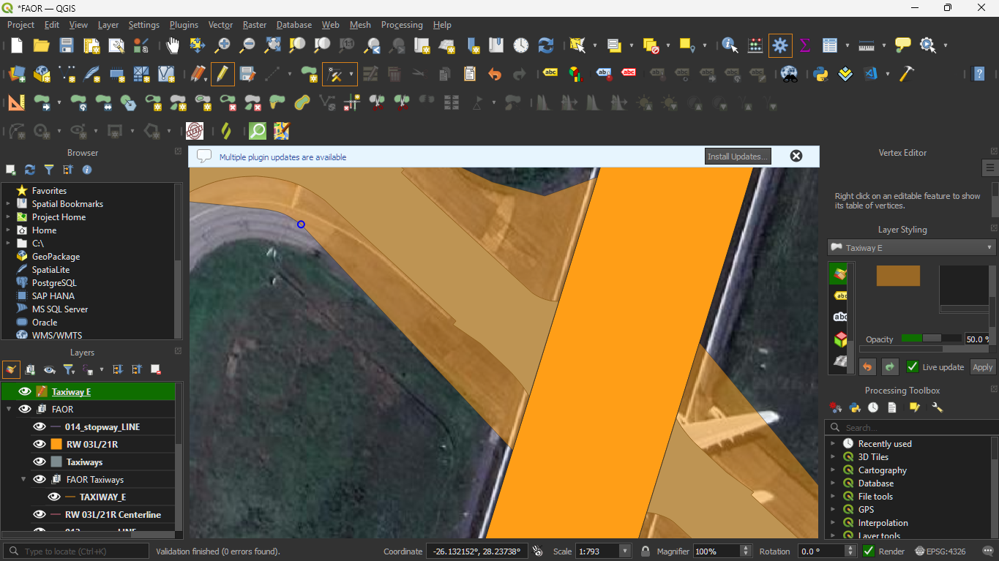

As good practice, it is best to align the vertices to the satellite taxiway or find a compromise if they are very close (as OpenStreetMap data may be slightly more up-to-date and accurate than satellite imagery).

After performing the necessary edits, you can change the opacity back to 100%:
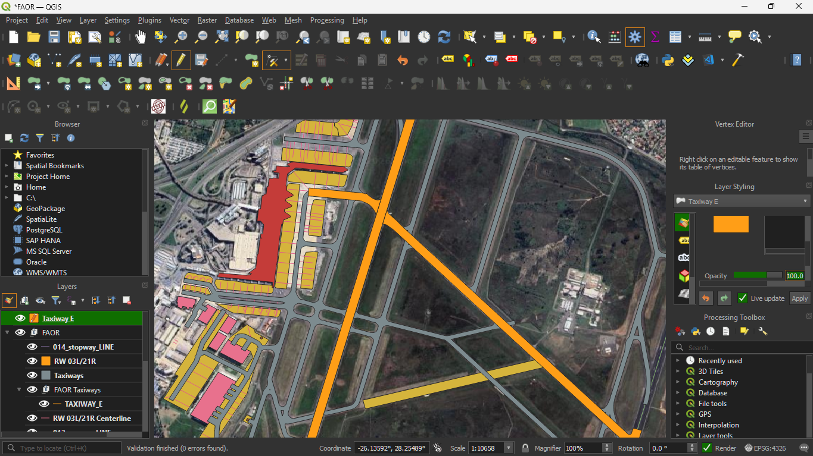

To exit edit mode click on the pencil icon and click save on the next dialog to save changes to that layer.

## Adding Additional Layers
To complete the ground layout, we need to add holding points and labels to the ground layout.

### Hold Short Lines
Starting off with holding points, make the holding points layer visible by clicking the eye icon:
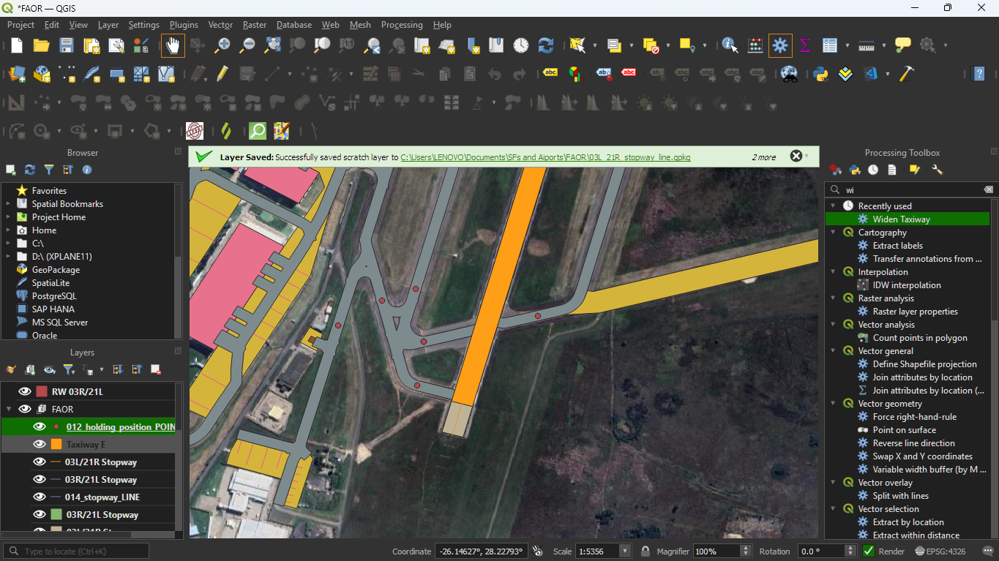

You should also move the layer to the top for visibility.
In order to create the holding points we need to create a new LineString layer.

Create a new GeoPackage layer by clicking on the globe icon:
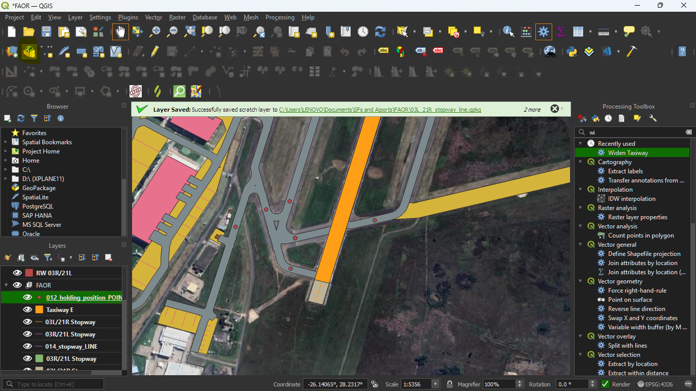


It will bring up a window like this:
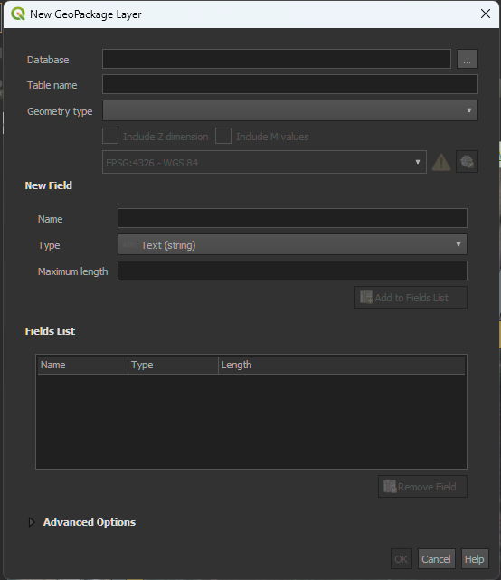

- Under database select an appropriate file name
- Table name will autofile
- Under Geometry type, select **LineString**

You should end up with something like this:
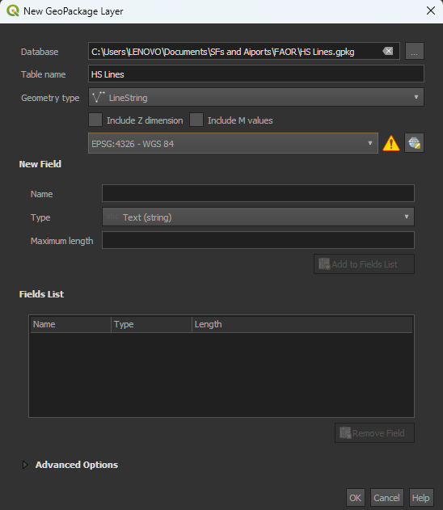

Press Ok to finish.

Enter edit mode by selecting layer and clicking the pencil icon.
Click on **Add Line Feature**, you will see a crosshair and use that to select two points to form that line then right click to finish adding that feature:
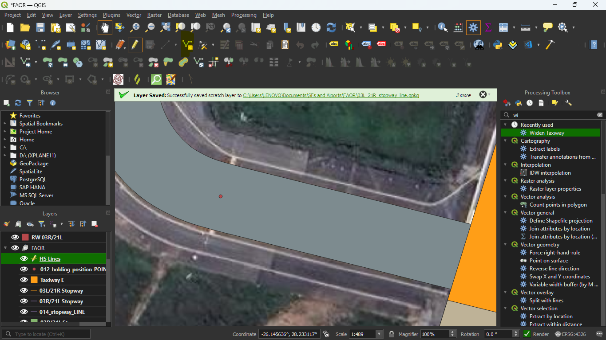

Whenever it asks you for a feature id(fid), leave it as Autogenerate.


Your end result should like something like this:
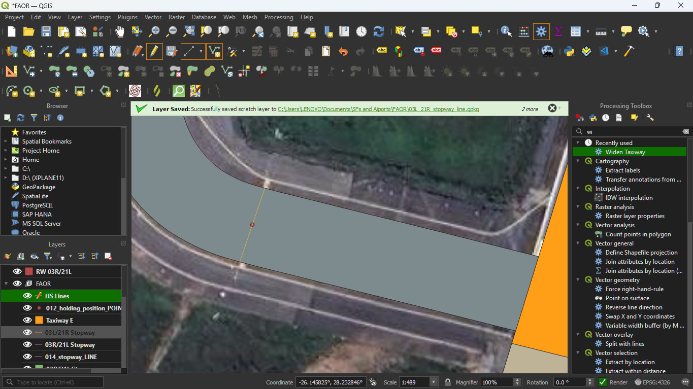

Repeat for all holding points on the airport.

!!! info
  If you need to move while still in the Add Line features, mode click on the hand icon in the top bar. Then you can reselect the mode after panning.

When done, exit edit mode and save changes to the layer. You may also delete the holding points layer.

The end result should look like this:
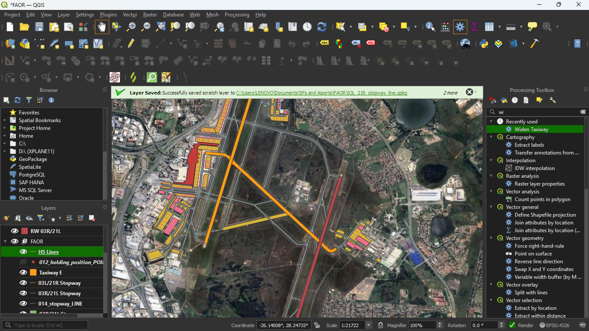

### Taxiway Labels
To add taxiway labels we will use the same process of creating a GeoPackage Layer, however we will change some of the properties and fields to the layer.

- Database - remains the same, choose an appropriate file name
- Table name - autogenerated
- Geometry Type - select **Point**

Under New field:
- Name should be `TEXT`
- Type is `Text (string)`
- No maximum length

Click Add to Fields list to add it to list of fields for this layer.
The dialog should look something like this:
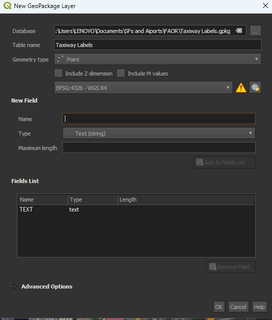

Press Ok to add the new layer.
To add a label for a taxiway, enter edit mode and similarly select Add Point Feature, the icon will be points instead of a line.
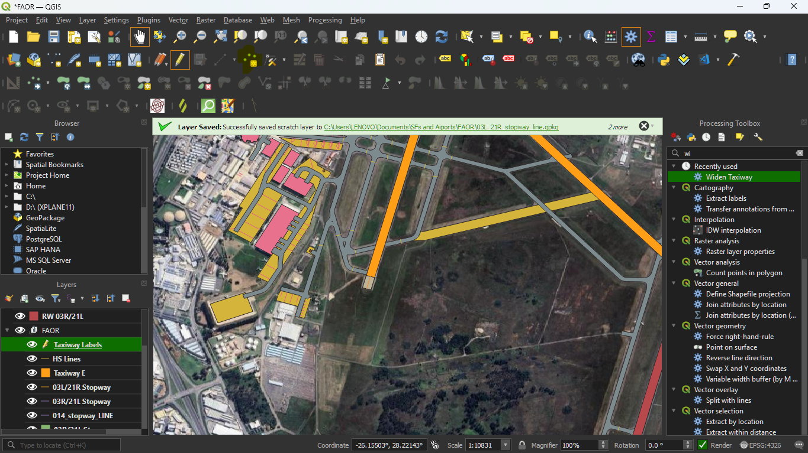

For this, reference appropriate taxi charts.

When you click anywhere where you want labels, you will see the feature addition form, with fid and the TEXT field. Add your taxiway letter here and confirm to add the feature to the taxiway labels layer:

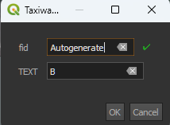

Similarly, repeat this for all taxiways.
Your result should like this (after exiting edit mode and saving):
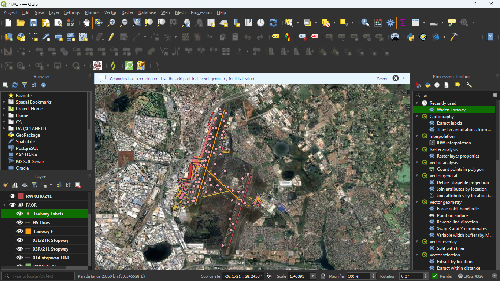

### Stand Labels
In a similar way we can label the stand Labels at the airport. There are two approaches:

- IF the airport does not have any stand data, then a stand layer can be created which can be used to populate `TopSkyStands.txt` with relevant stand data as we develop the ground layout

- IF the airport already does have stand data (which is true for FAOR), then you can create stand labels, using the previous method we discussedf for Taxiway Labels

For the sake of completeness in this guide, adding stand data will be demonstrated.

To add a stand layer, we can create a GeoPackage layer and add the following properties:
- Database:  an appropriate file name
- Table name: auto-generated
- Geometry type: **Point**

Fields to add in the field form  
**STAND**: This is a mandatory field, it is the name of the stand
- Type: Text (string)

**WTC**: The weight class of the stand.
- Type: Text (string)

**USE**: The use of the stand, civilian military, helicopter etc.
- Type: Text (string)

**AREA**: Whether or not the "stand" is a wider area, for example an apron that has free parking with no designated stands.
- Type: Boolean

Every field other than **STAND** is optional here, depending on the level of detail that you have for your ground layout.

After creating the stand GeoPackage, you can enter edit mode and similarly add all the locations of stands on the airport.

If you opted to add stand data for TopSky, you will get the add feature form giving you to extra fields that you specified.

After editing in, your result should look like this:
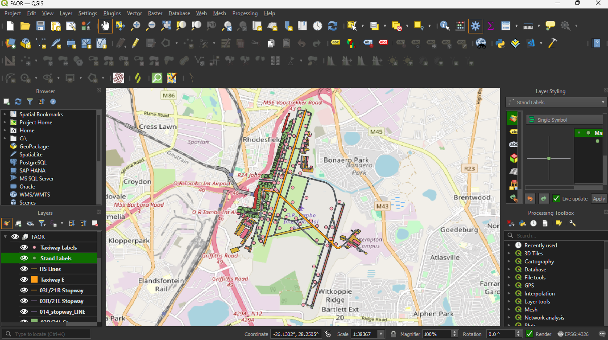

As you can see the stands are now in green.

### Adding Colour

To avoid further hassle later, we can assign each layer a colour value for the plugin to use during export. We will use the colour profile which looks like this

```json
{
	"colors": {
		"heliport": {
			"color": "96,96,96",
			"gr_color": "APRONSURFACE",
			"ts_color": "APRONSURFACE"
		},
		"apron": {
			"color": "96,96,96",
			"gr_color": "APRONSURFACE",
			"ts_color": "APRONSURFACE"
		},
		"taxiway": {
			"color": "96,96,96",
			"gr_color": "TWY2",
			"ts_color": "TWY2"
		},
		"terminal": {
			"color": "70,70,70",
			"gr_color": "BUILDING",
			"ts_color": "BUILDING"
		},
		"hangar": {
			"color": "70,70,70",
			"gr_color": "BUILDING",
			"ts_color": "BUILDING"
		},
		"helipad": {
			"color": "96,96,96",
			"gr_color": "APRONSURFACE",
			"ts_color": "APRONSURFACE"
		},
		"runway": {
			"color": "35,35,35",
			"gr_color": "HARDSURFACE2",
			"ts_color": "HARDSURFACE2"
		},
		"background": {
			"color": "25,25,25",
			"gr_color": "BACKGROUND",
			"ts_color": "BACKGROUND"
		}
	}
}
```
In the processing toolbox, under Aerodrome Utilities navigate to the Colorize algorithm.

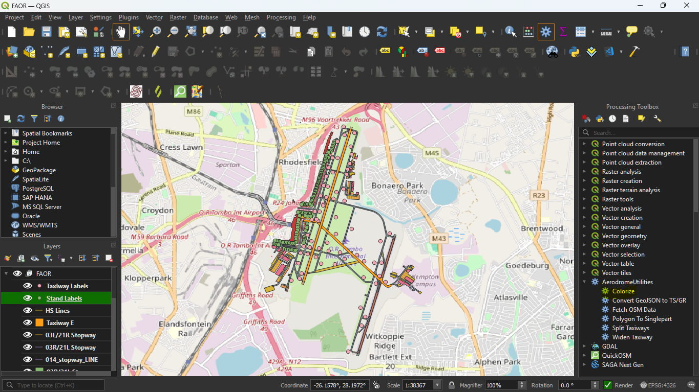

Double click to open the parameters of the algorithm:

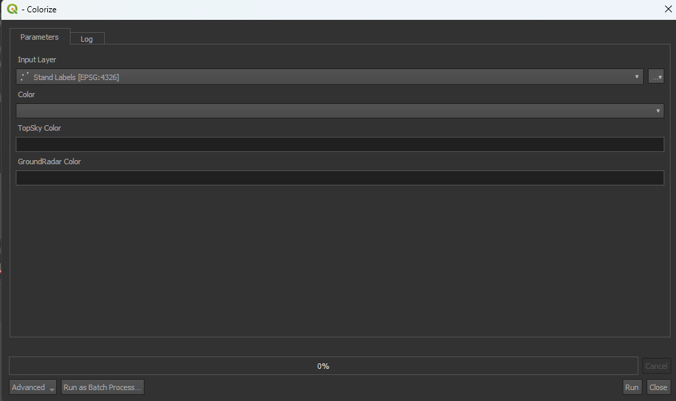

You will see 3 values that correspond to the keys in the JSON file. If you want to add colour to one layer, add the correct values for each input. Clicking on the colour field will reveal a colour matrix as well as places where you can add the RGB values. Note that you may have to scroll down to see the colours

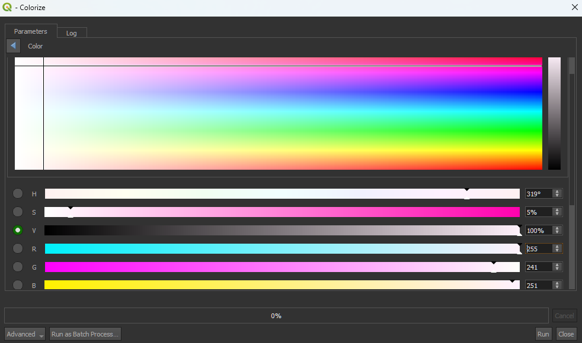

However if you are trying to add colour to every layer, then you need to run the algorithm as a batch process, At the bottom left corner, click run as batch process.

You will see something like this:

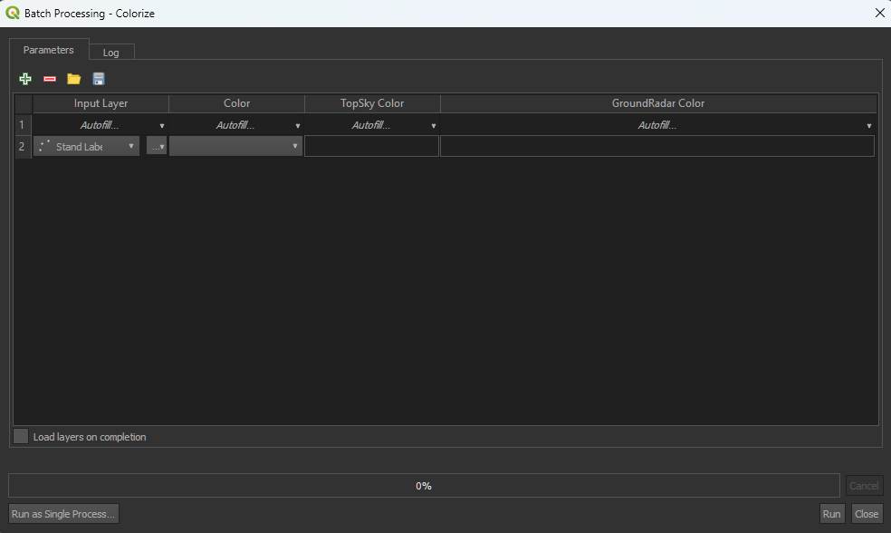

Under Input Layer, click `Autofill... > Select from open layers`

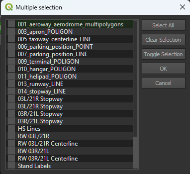

You can simply select all except `001_....`

You can specify colours, TopSky colour and GroundRadar colours per layer, then execute the algorithm by clicking `Run`. If the colour you need isn't listed in the profile, then you can use any colour that is defined either in the `TopSkyMaps.txt` or in the `GroundRadarMaps.txt` files as the exporter uses those definitions. The `Color` parameter itself is what is shown in QGIS and is completely up to you, although I recommend that it same the TopSky colours.


!!! info
  You can copy and paste inputs to make this a lot easier. For colours right-click, Copy and paste options exist.

Run the algorithm to add the colour properties to the layers.


## Exportation
- Delete any layers that are not visible or wouldn't be seen in the ground layout.
- Rename layers to appropriate names by right clicking the layer and renaming.

The ground layout should now look like this:
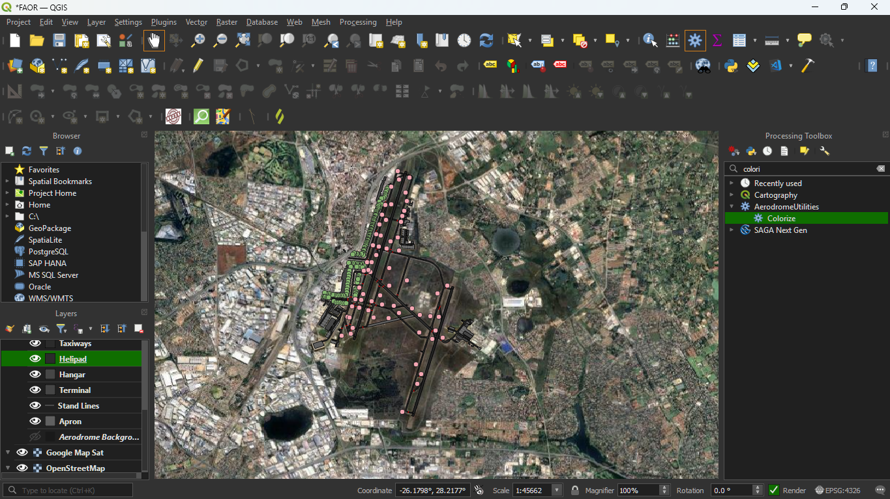

- Hide the map layers

- Make the aerodrome background layer visible. Your ground layout should now look like this:
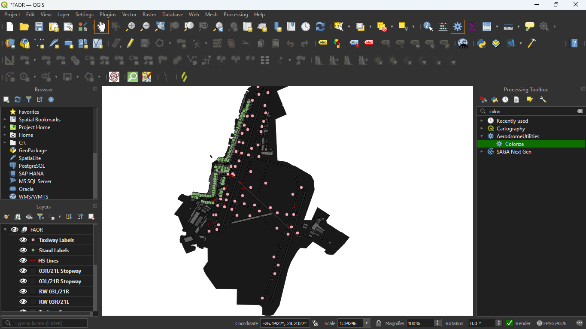

- Shift-click everything except the hidden map layer else and create a group named after your ICAO (if not already done)

- Move back to the processing toolbox and select `Convert GeoJSON to TS/GR`
- You will see a panel with ICAO code input, multi map and output directory.
- For simplicity's sake, we will export to GroundRadar, the TopSky file works similarly.
- Leave Multi Map unchecked, and enter the ICAO code and an appropriate output directory.
- Execute the algorithm
- You will find  a `GroundRadar.txt` file in that directory.

## Importation Into EuroScope
- In order to submit a new ground layout, it shouldn't:
  - Cause errors
  - Be broken
- To test the ground layout, open the folder where your fork has been cloned to your local system using VSCode or any other code editor
- Open the `GroundRadar.txt`
- Copy the contents and append to the relevant section of the `GRpluginMaps.txt` file in `Plugins/GroundRadar`
- For purposes of this guide, we will need to disable the existing FAOR ground layout, by checking for FAOR under Ground Layouts section and setting the first map's `ACTIVE` line from `ACTIVE:1` to `ACTIVE:0`
- Just below that add the ground layout code.
- Open EuroScope using the profile in the "Outer" directory.
- You should now see the groundlayout
-  After visually confirming the ground layout
-  Creating a new branch by using `git checkout -b {branch name}`
-  Add all files `git add .`
-  Create a commit `git commit -m {commit message}`
-  Push upstream to your fork: `git push origin {branch name}`
-  You will see a notification to compare and pull reuqest if you view the main sectorfile repository:
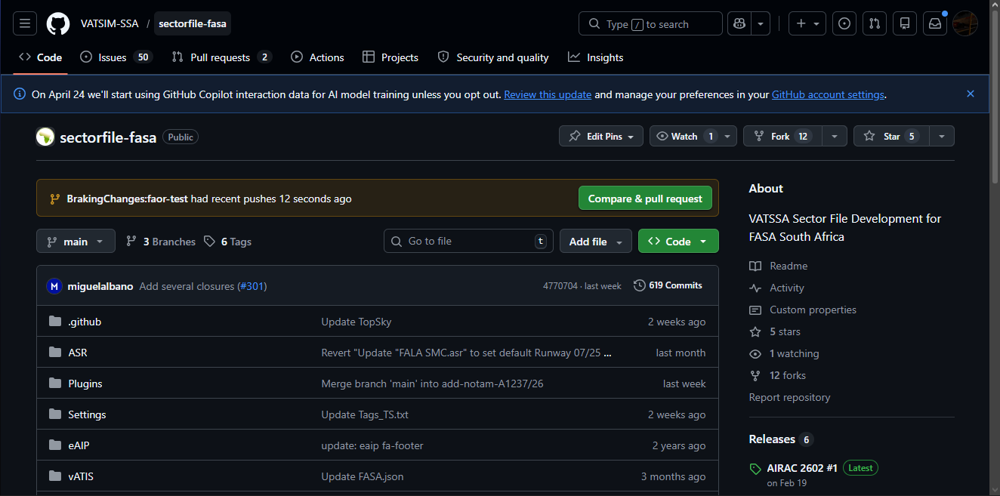
- Click Compare and Pull Request to create a pull request
- Just fill in the template and you have created your first pull request
- Pull request do not change the content of the sectorfiles until they are approved and submitted, so feel free to create as many contributions as possible!