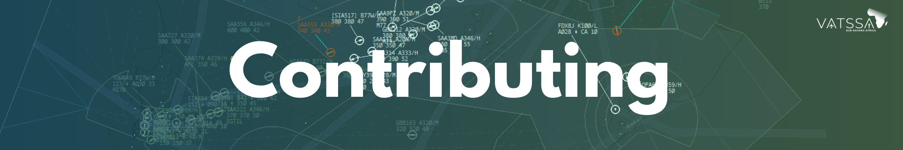

# Overview

Welcome to VATSSA's contributing guide. These quick guides have been setup to teach you how to contribute to our eAIP or Sector Files. VATSSA welcomes any and all help we can get in relation to our eAIP or Sector Files, both of which are constantly being devloped. To give you the best start we have created some user friendly contributing guides. We aim to take you from zero experience to a contributor of our eAIP and Sector Files.

## Notes

- If you have not, please request the relevant contributor roles on our Discord Server, a link to which can be found [here](community.vatsim.net)

- Our eAIP and Sector Files are based off of GitHub.

- We don't require any previous experience.

- Pull Requests are reviewed on a regular basis by our Maintainers

- These guides is not exhaustive. For additional support or questions you can message in our contributor chats on Discord.

## Exclusion of Liability

!!! warning
    All documentation in this section is intended solely for use on the VATSIM network and must not be used for real-world aviation operations. The authors disclaim any liability for personal injury or death resulting from misuse of this material.
