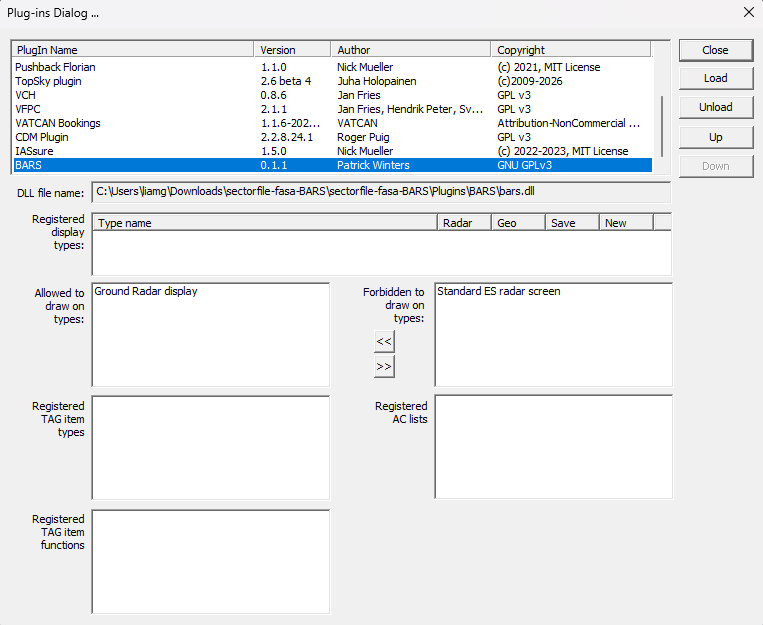
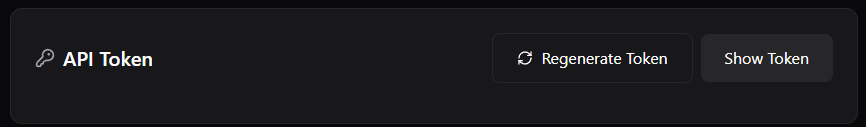
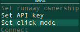
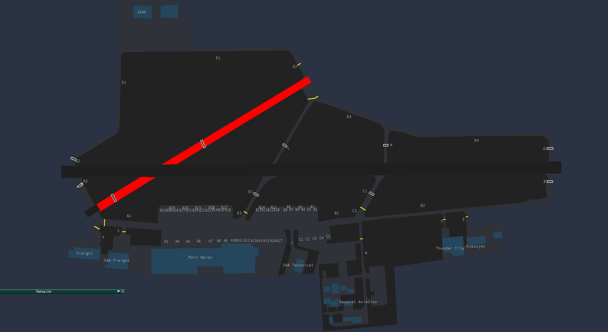

# BARS Plugin for FASA

## Overview
BARS is an addon for Microsoft Flight Simulator that guides pilots using taxi lights to the runway or to a designated area on the airport. To make this happen, controllers can click on the BARS and guide the aircraft to the BAR. 

## Installation

BARS is configurated in the sector file already (depending on version, BARS is not currently in the sector file), however you need an API link to connect to the BARS network and allow BARS to draw on the Ground radar. Below is the step by step guide from the start to your first connection on the BARS network.

### Ground Radar

To allow bars to draw on the groundradar, you need to go to OTHER SET and plug-ins. This will open a window for the sector files plugins, you will find BARS in this list. You need to allow BARS to draw on the Ground Radar display. You can do this by selecting the "Ground Radar display" and clicking the two arrows. This should move the "Ground Radar display" to the other list. This will allow BARS to draw on the Ground Radar when connected. 

### Image to display plugins page

### Account

To connect to the BARS network, you need an API code. This requires you to visit the BARS website. Simply, create an account and regenerate an API token. Also remember to verify your email with a 6 digit code to allow you to connect. Now you are ready to connect to the network. The link to the BARS website in the "Resources" page of the eAIP under software.

### Simply show token or regenerate token

### Setup

Click on the "BARS OFF" popout and insert your API token (copied from the website.) After this is completed,  BARS should automatically connect. The next step, for BARS to work you need to setup your runways. By clicking the BARS popout, you should see "Set Runways". To set your runways, click on the runways you are using. This will now draw the stopbars. To highlight the BARS, left click on them. 

### Paste that token into API Key

## End result

### Runway 01/19 runway setup with BARS visible

## Note

BARS isn't commonly used. Aircraft using BARS will have a visible green dot . BARS is not required to be used, it's just a cool addition to the VATSIM experience. Bugs could occur, if so create an issue in the FASA github repo. Until V2, BARS is only available at FACT due to lack of V1.1 profiles.
