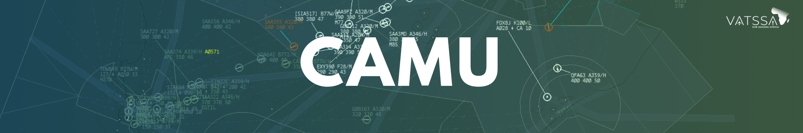

# CAMU (CDM) - Guide

## What is CAMU?

CAMU (Central Airspace Management Unit), also known as CDM (Collaborative Decision Making), manages demand and capacity across the network by coordinating departure slots, regulating outbound flow rates, and adjusting traffic patterns to prevent sector or airport overload. By providing a structured approach to traffic sequencing and delay management, CAMU ensures smoother operations and more consistent handling during high-traffic conditions and major events.

!!! warning

    CAMU (CDM) plugin is only intended for usage during events, and not regular usage when controlling.

## Definitions

| Abbreviation| Description                          |
| :---------: | ------------------------------------ |
| `EOBT`      | Estimated off block time             |
| `TOBT`      | Target off block time                |
| `TSAT`      | Target Start-Up Approval Time        |
| `TSAC`      | Target Start-Up Approval Communicated|
| `ASAT`      | Actual Start-Up Approval Time        |
| `ASRT`      | Actual Start-Up Request Time         |
| `CTOT`      | Calculated Take Off Time             |

## Activating CAMU

The plugin is split into 2 roles, "master" and "slave". The "master" should be the lowest ATC position, usually delivery.

When CDM is in use, an aerodrome should always have master, **however only 1 master per aerodrome is permitted**. Controllers may be the master at 2 airports if covering topdown, simply use the command below.

`.cdm master {airport}` should be used to become the master of the selected aerodrome.

Master is the "admin" of the aerodrome, and is the only controller with the functionality of editing CDM times.
Slave's monitor the CDM times of the aerodrome, CDM times will be received from the master. Controllers are automatically put into the slave state.

### Controller Change

During a controller handover, the current master (old controller) will change to a slave using `.cdm slave {airport}`, the new controller will then use the `.cdm master {airport}` command to become the new master.

## Commands

| Command                                            | Description                                                                                 |
| :------------------------------------------------- | ------------------------------------------------------------------------------------------- |
| `.cdm refresh`                                     | Force the refresh phase to do it now.                                                       |
| `.cdm master {airport}`                            | Become the master of the selected airport.                                                  |
| `.cdm slave {airport}`                             | Turn back to slave of the selected airport.                                                 |
| `.cdm customdelay {airport}/{runway} {time-start}` | Moves all TSATs for the selected airport and runway. Use time **9999** to remove the delay. |
| `.cdm lvo`                                         | Toggle LVP's on or off.                                                                     |
| `.cdm recover {airport}`                           | In case of of CTD, it tries to recover the latest time status backed up in the server.      |
| `.cdm help`                                        | Sends a message with the available commands.                                                |

## Functions and Colours

### TOBT

If there is no existing TOBT, to add a TOBT, click on the column of the aircraft to set the current time as the TOBT. 

| Colour                                              |                 |
| :-------------------------------------------------- | :-------------- |
|  `LIGHT GREEN` | Before TOBT -5. |
|  `DARK GREEN`    | TOBT -5 to -2   |
|  `YELLOW`                  | TOBT -1         |

### TSAT

TSAT is defined as the TTOT minus the taxi time.

| Colour                                              |                     |
| :-------------------------------------------------- | :------------------ |
|  `LIGHT GREEN` | TOBT -35 to TSAT -5 |
|  `DARK GREEN`    | TSAT -5 to +5       |
|  `YELLOW`                  | TSAT +5 to +6       |

### CTOT

Shows the aircraft's CTOT

| Colour                              |                   |
| :---------------------------------- | :---------------- |
|  `GREEN`     | CAMU Server CTOT  |
|  `ORANGE`  | Manual/Event CTOT |
|  `RED`           | Flow/CAD CTOT     |

### NET

Shows the status from the CAMU Network

| Colour                       |                                            |
| :--------------------------- | :----------------------------------------- |
|  `REA`    | Sends a REA message                        |
|  `PRIO` | Sets aircraft to top priority              |
|  `SUSP` | When an aircraft's flightplan is suspended |

## Usage

### Delivery (DEL)

When CAMU is in use, pilot's should call for clearance as normal, however DEL should inform the pilot of their CTOT.

!!! info "Phraseology"

    SAA304, readback correct, CTOT 1203

When the pilot calls for start, the master should left click the TOBT column to generate timings (if not already there).
If the TSAT of the aircraft is ±5 minutes, shown in a  `DARK GREEN` colour, then the aircraft should be handed off to SMC.

!!! info "Phraseology"

    SAA304, hold position, contact ground 121.900

If the aircraft calls prior to the ±5 minute window, shown in a  `LIGHT GREEN` colour, then the aircraft should be told to hold position and a TSAT should be passed on.

!!! info "Phraseology"

    SAA304, CTOT 1203, hold position

!!! warning

    When handing off from DEL to SMC, DEL should set the status of the aircraft to "S/UP".

**Missed Slot**

If the aircraft is not marked with "S/UP" before TSAT +6, CAMU will determine the aircraft as suspended shown by  `SUSP` in the NET column. When the aircraft calls ready for start the process is to be as normal (above).

### Surface Movement Control (SMC)

When an aircraft calls for start, SMC should confirm that the TSAT is within ±5 minutes, shown  `DARK GREEN` colour, before giving start.

### Tower (AIR)

The AIR controller should make use of the TTOT/CTOT timings to determine the departure order of aircraft.

## Pilot Submitted TOBT

Pilots are able to submit their own slot (TOBT) time through [vats.im/vdgs](https://vats.im/vdgs). Through this system, pilots are able to manually input their TOBT and view their TTOT/CTOT among other information.